.. 自主飞行之入门:

==========================
自主飞行之入门
==========================

1.ROS
========

ROS官网: `维基 <http://wiki.ros.org/>`__ 

ROS是用于开发复杂的分布式机器人系统的广泛使用的框架.

a. 安装
^^^^^^^^^^

主要参考: `官网安装说明 <http://wiki.ros.org/kinetic/Installation/Ubuntu>`__

在飞机上的机载计算机TX2上已经安装好了ROS.

如果要在PC上面使用ROS,我们建议使用Ubuntu Linux系统.Windows系统下面可以使用VMware虚拟机,Mac系统可以使用 **VirtualBox** 或者是 **Parallels Desktop Lite**

.. tip::

    我们建议使用Ubuntu18.04与之相对应的ROS版本Melodic.

b.基本概念
^^^^^^^^^^^^^^^

**节点(nodes):**

主要参考来源: `ROS节点 <http://wiki.ros.org/Nodes>`__

ROS节点是一个特殊的程序,通常使用Python或者C++编写,可以通过ROS主题和ROS服务与其他节点进行通信.将复杂的机器人系统划分为孤立的节点具有某些优点:减少代码的耦合性,提高可重用性和可靠性

许多机器人库和驱动程序都是以ROS节点的形式执行.

为了将普通程序变成ROS节点,请包含rospy或roscpp库,并插入初始化代码.

2.MAVROS
==========

3.px4_command介绍
====================

px4_command功能包是一个基于PX4开源固件及Mavros功能包的开源项目，旨在为PX4开发者提供更加简洁快速的开发体验。
目前已集成无人机外环控制器修改、目标追踪、激光SLAM定位、双目V-SLAM定位、激光避障等上层开发代码、后续将陆续推
出涵盖任务决策、路径规划、滤波导航、单/多机控制等无人机/无人车/无人船科研及开发领域的功能。
配合板载计算机(树莓派、TX2、Nano)等运算能力比较强的处理器，来实现复杂算法的运行，运行得到的控制指令通过串口或者网口通信发送给底层控制板。

.. image:: ../images/framework.png

-   **state_from_mavros.h**:订阅飞控状态,包括无人机当前的状态(/mavros/state),当前位置(/mavros/local_position/pose),当前速度(/mavros/local_position/velocity_local),和当前角度,角速度(/mavros/imu/data)
-   **command_to_mavros.h**:发布px4_command功能包生成的控制量至mavros功能包,可发送期望位置,速度(本地系与机体系),角度,角速度,底层控制(遥控器输入)
-   **px4_pos_estimator.cpp**:订阅激光雷达或者mocap发布的位置信息,并进行坐标转换,在state_from_mavros.h中已订阅飞控发布的位置,速度,欧拉角信息,此处直接使用,根据订阅的数据,发布相应的位置,偏航角给飞控
-   **px4_pos_controller.cpp**:订阅由位置估计发布的DroneState,初始化当前飞机状态的时间.订阅ControlCommand(不知从何发布的数据).发布topic_for_log主题.在选择控制率,检查参数正确后,初始化完成.对move节点中,takeoff,Move_ENU,Move_Body,Hold,Land,Disarm,PPN_land和Trajectory_Tracking等进行逻辑处理.
-   **ground_station.cpp**:订阅自定义日志主题(/px4_command/topic_for_log),订阅视觉系统位置估计PoseStamped主题(/vrpn_client_node/UAV/pose,非mavlink消息,数据包括point位置(x,y,z),四元数方向(w,x,y,z)),订阅飞控姿态四元数AttitudeTarget主题(/mavros/setpoint_raw/target_attitude,#82号mavlink消息).不断的更新视觉传感器状态,并打印当前飞机的状态.
-   **px4_sender.cpp**:订阅自定义消息控制指令主题(/px4_command/control_command),机体系到惯性系坐标转换,move中控制命令的具体实现(0表示位置控制,3表示速度控制)
-   **autonomous_landing.cpp**:降落识别使用xyz均为速度控制.订阅数据包括降落板与无人机的相对位置,降落板与无人机的相对偏航角,视觉flag 来自视觉节点.最后发布位置控制指令
-   **collisiom_avoidance_streo.cpp**:订阅/streo_distance该数据作为计算飞机四个方向的距离判断.
-   **formation_control_sitl.cpp**:多机仿真SITL,只适用于Move_ENU坐标系下,若使用Move_Body,需自行添加修改.
-   **payload_drop.cpp**:订阅/mavros/local_position/pose本地位置.发布遥控器通道值.
-   **square.cpp**:发布/px4_command/control_command命令.子模式xyz均为位置控制.
-   **target_tracking.cpp**:
-   **move.cpp**:发布/px4_command/control_command,并设置子模式xy速度控制(0b10),位置控制.z速度控制(0b01),位置控制
-   **set_mode.cpp**:模拟遥控器,根据mavros服务,进行在SITL下解锁,切换offboard,控制飞行器.
-   **TFmini.cpp**:激光定高雷达的处理,如果需要添加超声波传感器,可参考此代码.

4.飞行前准备
===============

飞行前请确保可以在手动模式下进行正常飞行，并且QGC以及远程连接上飞机的飞控

飞行环境说明
^^^^^^^^^^^^^^

室内环境
"""""""""""

激光雷达
************

室内我们采用的激光雷达进行定位，因为采用的二维雷达，会在室内构建出如下的平面地图

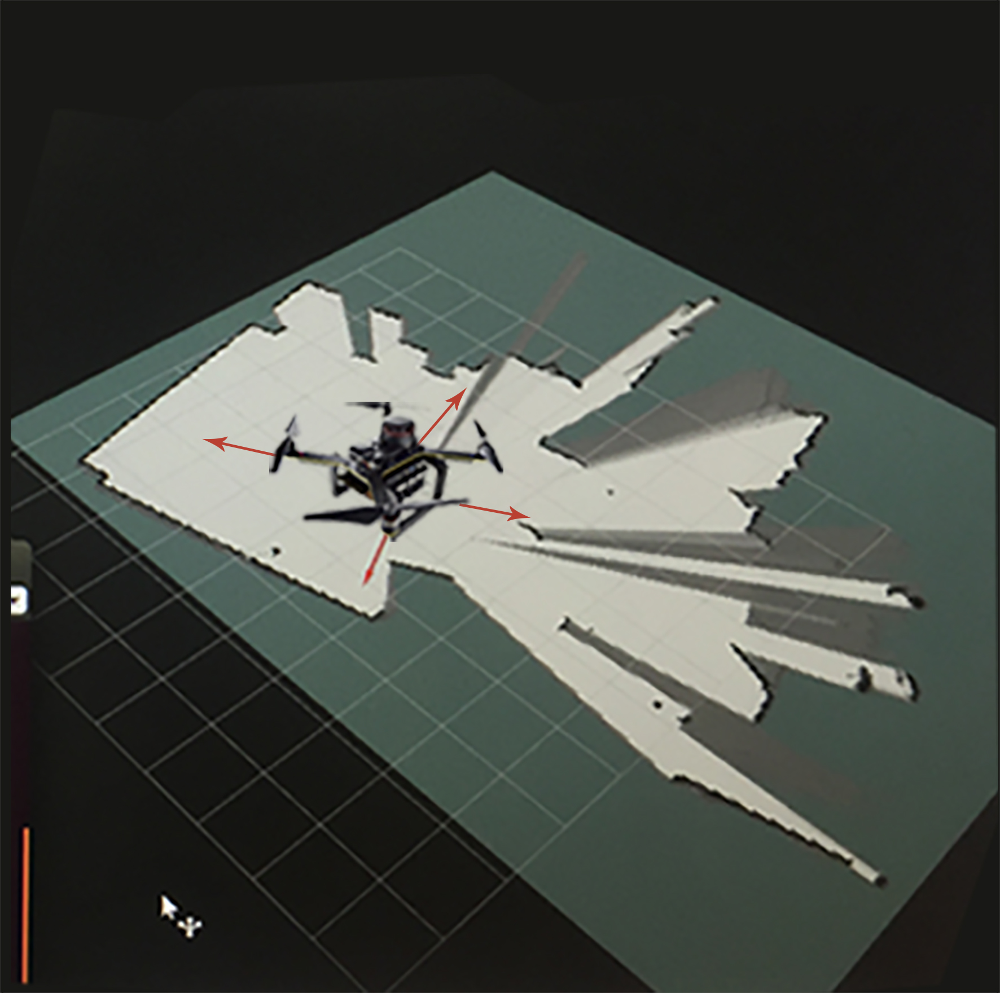

所以在测试以前要选择一个房间大小合适(A1/A2雷达半径12米有效，A3雷达半径25米有效)，房间不能地形非常复杂，也不能没有角点和几何特征点，否则不能很好的构建出地图，就不能很好的定位。

我们的测试环境如下：

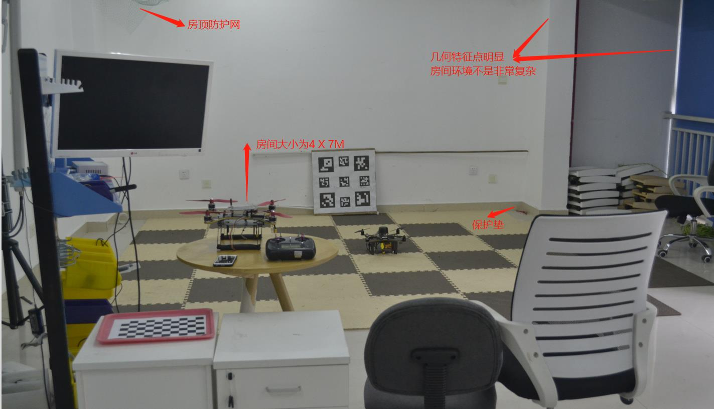

房间内有一些防护装置，房顶的防护网，地面的保护垫等等最好具备，防止伤人和损坏飞机。

视觉SLAM
*************

视觉的室内环境也是如上图所示环境,在室内可以添加一些桌椅板凳放置视觉前方,以便能有较好的特征点.

室外环境
"""""""""""

视觉SLAM
*************

室外视觉的环境,可以选择在马路旁边的树下面,视觉所能覆盖的视野包括树,马路,以及楼区,这样特征点多一点,效果能好.
在视觉slam中就尽可能不要选择空旷,单一特征点的地方,如操场.我们实验室经常测试视觉的环境,有马路,有草地,有房屋,
如果视野只有单纯的草地,视觉定位就不是很好.容易漂移.

GPS/RTK
************

室外使用GPS/RTK时,应当选择较为空旷地方,不要在房屋旁边或者树的旁边,搜星信号会很差.推荐在公园绿地或者操场中.

5.自主飞行说明
==================

自主飞行可分为室内和室外两种模式,相应的室内分为激光SLAM飞行模式和视觉SLAM飞行模式,室外分为视觉SLAM飞行模式和GPS/RTK飞行模式.
每一种飞行模式又对应分为TX2板载计算机和Nano板载计算机.在每一种飞行模式中,你就可以进行室内外相应的实现定点飞行,降落等.

.. tip::

    每一种飞行模式的位置来源有所不同,这里在QGroundControl地面站中有两个非常重要的参数,该参数决定了使用不同的飞行模式需要选择不同的位置数据来源
    EKF2_AID_MASK和EKF2_HGT_MODE,前者是位置数据来源参数.后者是高度数据来源参数.

室内飞行
^^^^^^^^^^^^^

激光SLAM
"""""""""""

室内激光雷达定位模式

-   EKF2_AID_MASK = 24 （选择位置以及偏航来源） ； EKF2_HGT_MODE = Vision/Range sensor（选择高度来源）   

**TX2**
*************

参数确定后尝试解锁，遇到解锁不成功，看看提示是否需要重新校准磁罗盘？解锁成功，电机启转，这时切记不要上浆试飞，
因为此时激光雷达没有工作，没有给飞控送入位置以及高度信息，所以此时姿态控制失效，飞机一飞就会偏。这是我们固件
的bug，近期会修复，请注意。

在TX2板载计算机系统里打开终端进入如下图所示目录并启动脚本：

::

    ./my_lidar_imu_fly.sh

脚本会依次启动各个launch文件

正常情况下各个窗口会正常工作，其中有个 **px4_pos_estimate** 节点要特别注意，如下图。

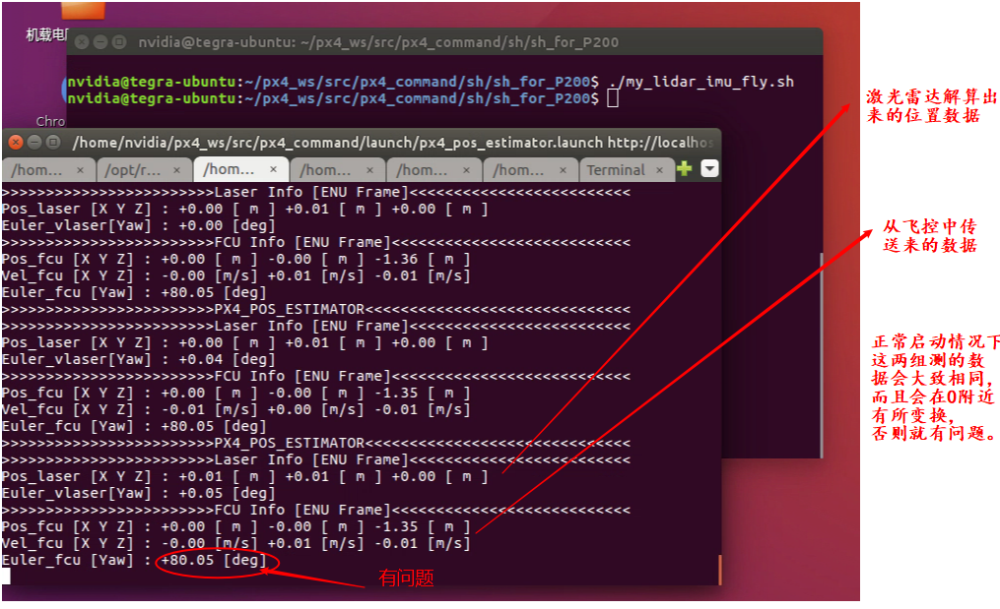

当出现上述问题，需重新启动飞控以及脚本,飞控的重启需要在地面站的控制台上，输入 **reboot** 然后回车即可。

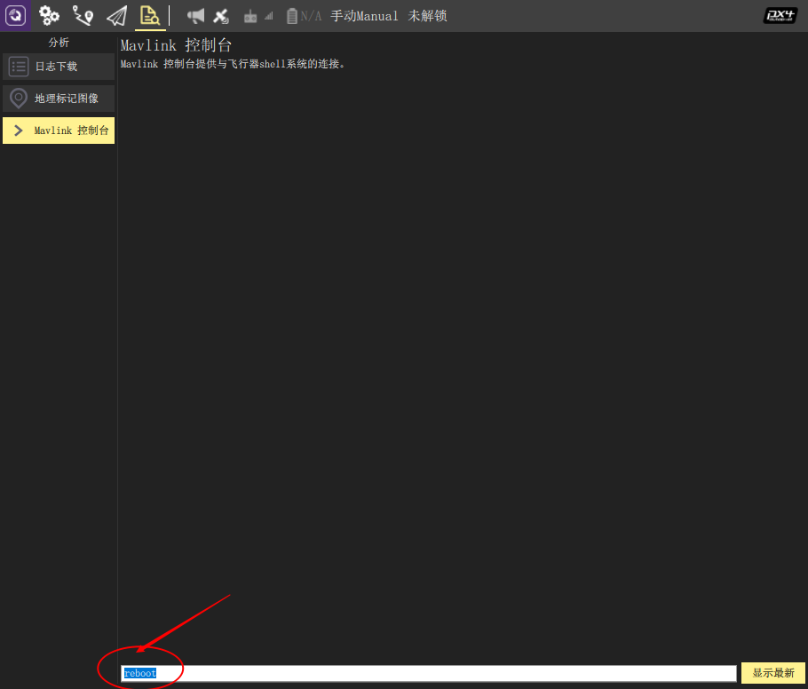

**NANO**
*************

与TX2类似,找其相应的启动脚本即可.

视觉SLAM
""""""""""""""""

室内视觉SLAM定位模式

-   EKF2_AID_MASK = 24 （选择位置以及偏航来源） ； EKF2_HGT_MODE = Vision/Range sensor（选择高度来源）   

**TX2**
*************

把飞机放在室内待起飞点，远程已连接好板载计算机与飞控。

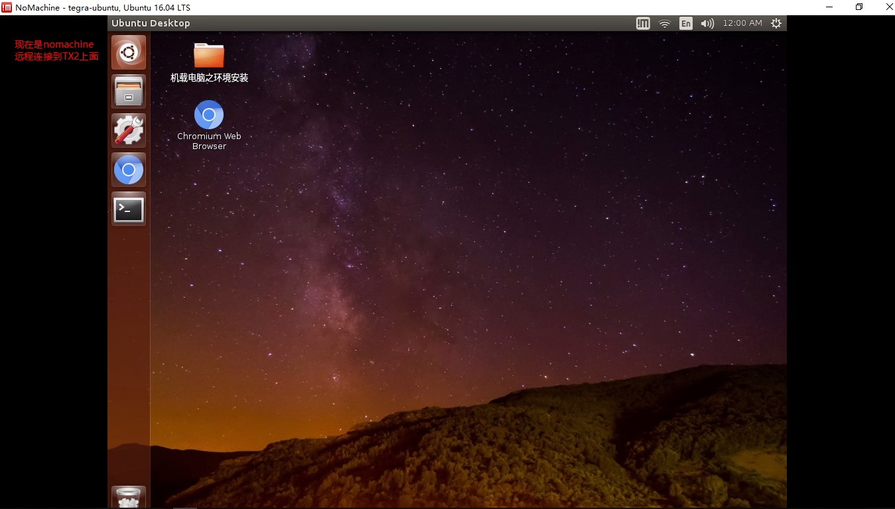

现在已经连接上了nomachine,第一步就是打开目录,进入到amov_ws/src/px4_command/sh/sh_for_P200/vio目录下面,待会准备启动的脚本为vio_fly.sh.(图片)

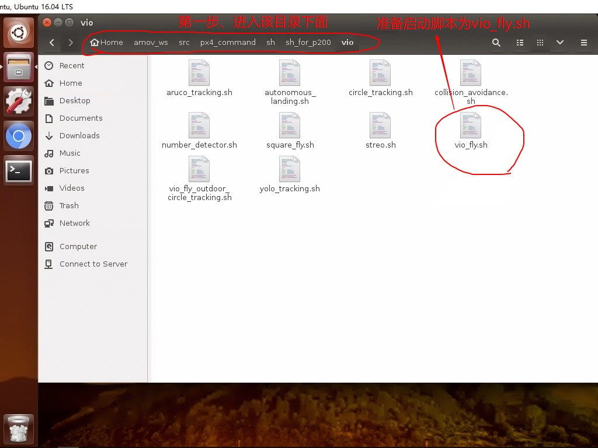

然后进行第二步,鼠标右击空白处选择打开一个终端(图片)

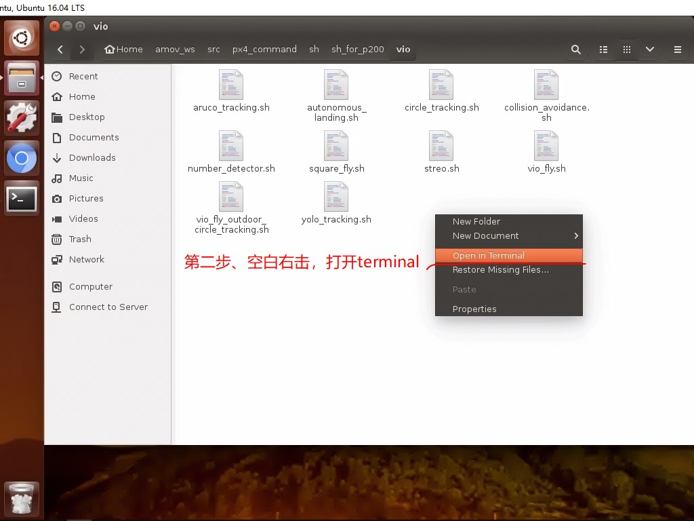

第三步输入启动脚本的执行指令 ./vio_fly.sh

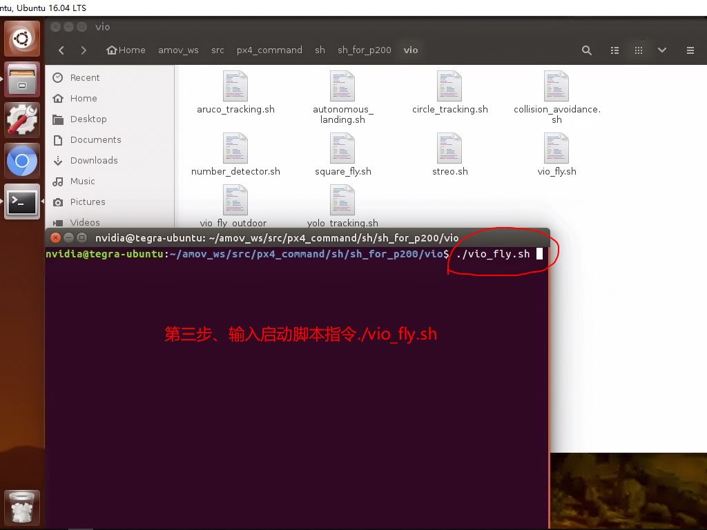

第四步,启动脚本完成之后,自动开启脚本终端.第一个终端为 roscore 此处不做详解.查看mavros脚本是否正常启动,如果红圈内容说明mavros正常与飞控已经建立了通信连接.
(如果出现报错的话,请仔细查看报错的内容原因是什么,坐标系相关的报错是正常的,不影响我们飞行使用).图片

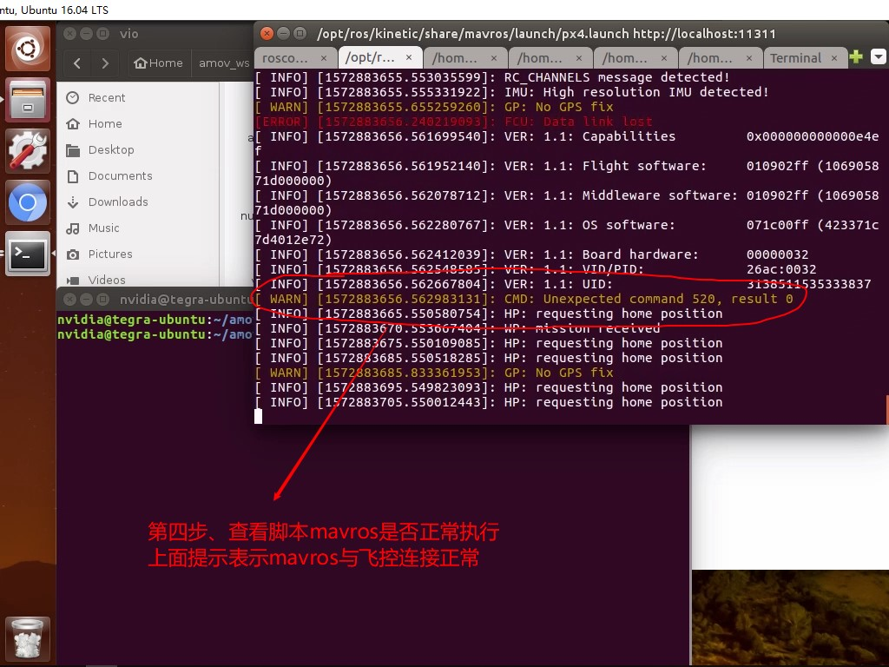

第五步,该脚本是T265驱动启动脚本,该脚本正常运行,说明T265已经正常启动.

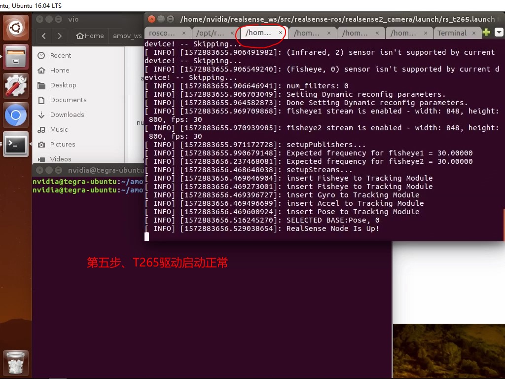

第六步,是T265的处理脚本,不是异常错误就是正常的,此脚本角T265的位置信息提供给了位置估计节点,以用作位置估计定位

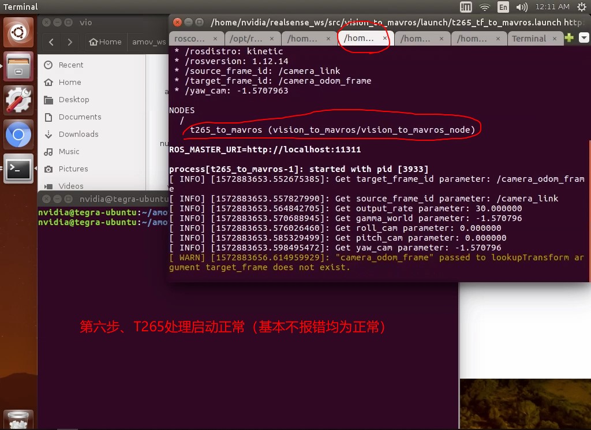

第七步,位置估计脚本,此处有多处打印消息,包含视觉信息,飞控信息,两者的各个数据基本保持动态波动就是正常的,波动很大就是非正常现象.如下图所示为正常.

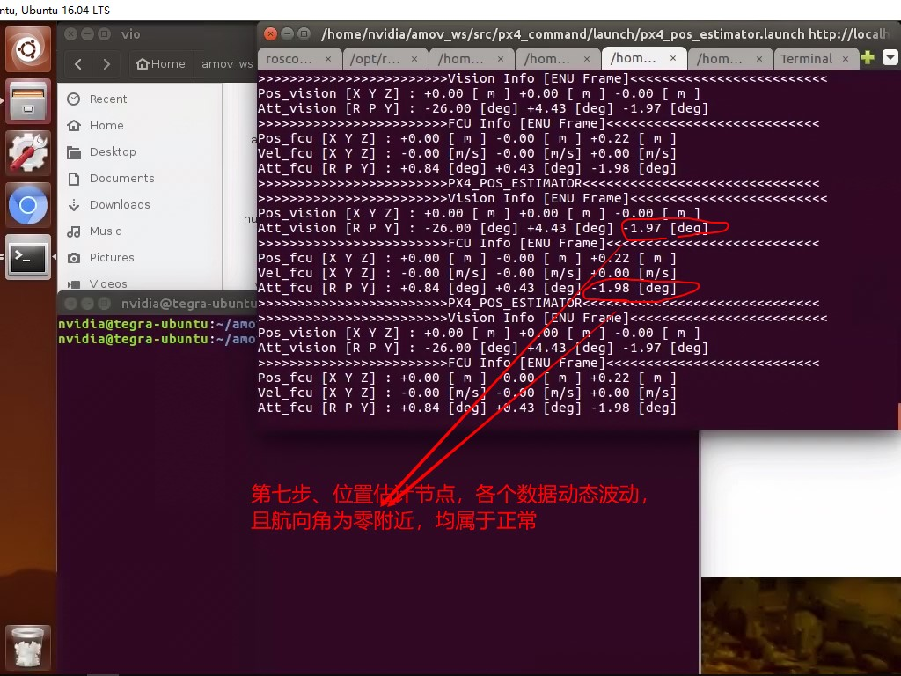

第八步,是位置控制节点,按照提示输入1继续,它是位置环参数的初始化.如果此处不输入1继续的话,你可以在室内进行定位飞行,但是不能切换到offboard模式.
只有输入了1,确认位置环参数之后,才能进入offboard模式.

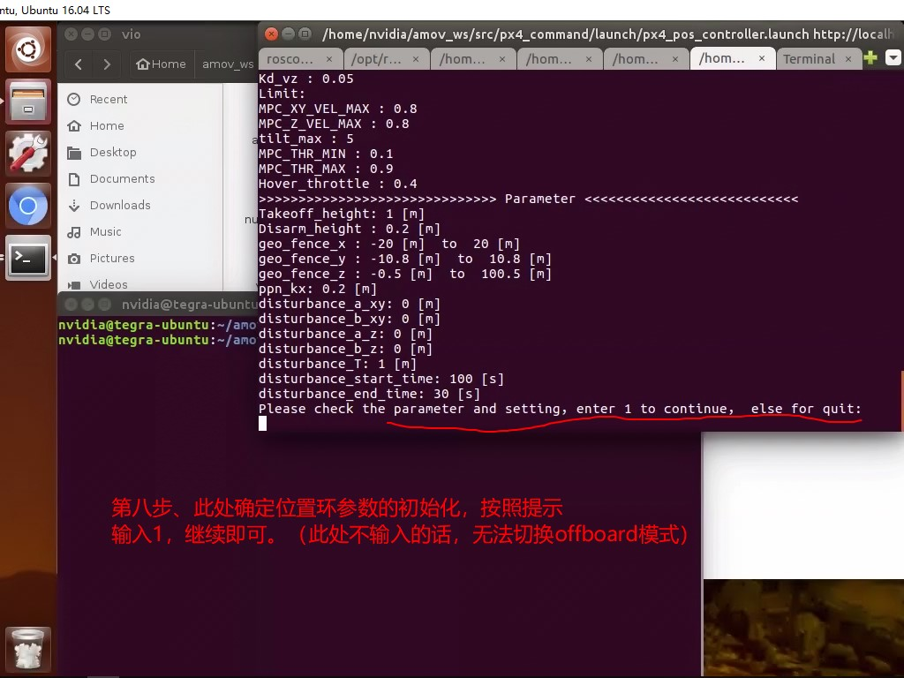

第九步,为move节点,正常启动.他可以控制飞机前后左右,位置速度控制飞行.

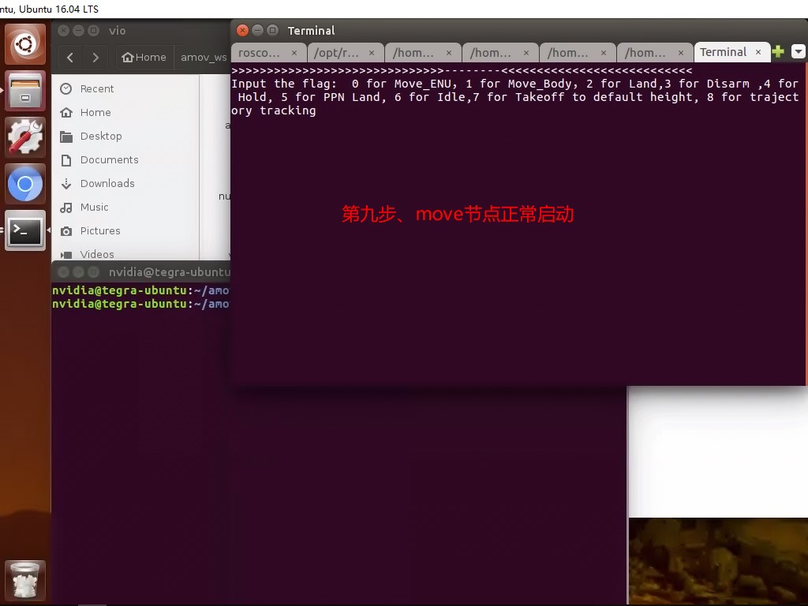

此时你也可以用另外一台电脑连接到飞控中去,按照开箱第一步的教程执行.上面脚本如果都能正常运行的话,此时在遥控器上的5通道(三段)拨到中间,
将飞行模式改为定点模式,在地面站QGC上面可以看到是可以切到定点飞行模式的,这就说明,此时可以在室内进行定点飞行了.

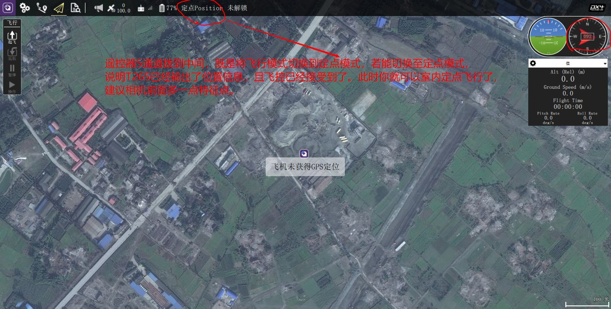

**NANO**
*************

使用操作和TX2类似,区别在于文件目录不一致.

室外飞行
^^^^^^^^^^^^^^

视觉SLAM
"""""""""""""

-   EKF2_AID_MASK = 24 （选择位置以及偏航来源） ； EKF2_HGT_MODE = Barometric pressure/GPS/Vision（选择高度来源）   

**TX2**
*************

待续......

**NANO**
*************

GPS/RTK
""""""""""""""""""""""""""

-   EKF2_AID_MASK = 1 （选择位置以及偏航来源） ； EKF2_HGT_MODE = Barometric pressure/GPS（选择高度来源）   

**TX2**
*************

待续......

**NANO**
*************

经过入门本章内容,你就可以在室内外进行定点飞行,若遇到困难请上论坛求助： `阿木社区论坛 <http://bbs.amovauto.com/>`_ .

在下一章自主飞行之进阶中,会详细讲解如何在室内进行move控制,自主跑四边形,室外圆跟踪等demo实现教程.

