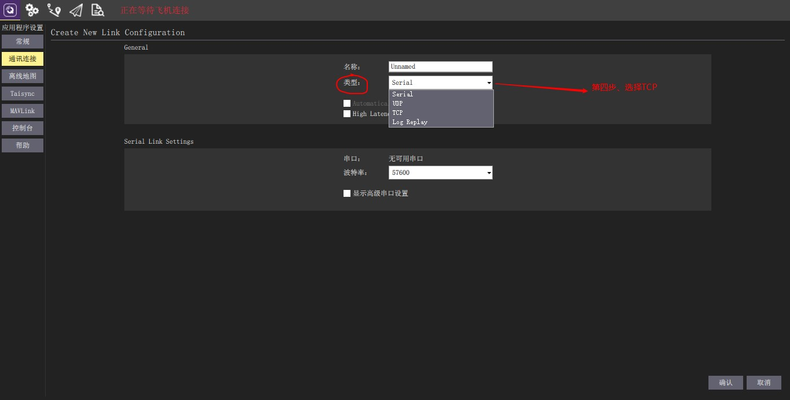
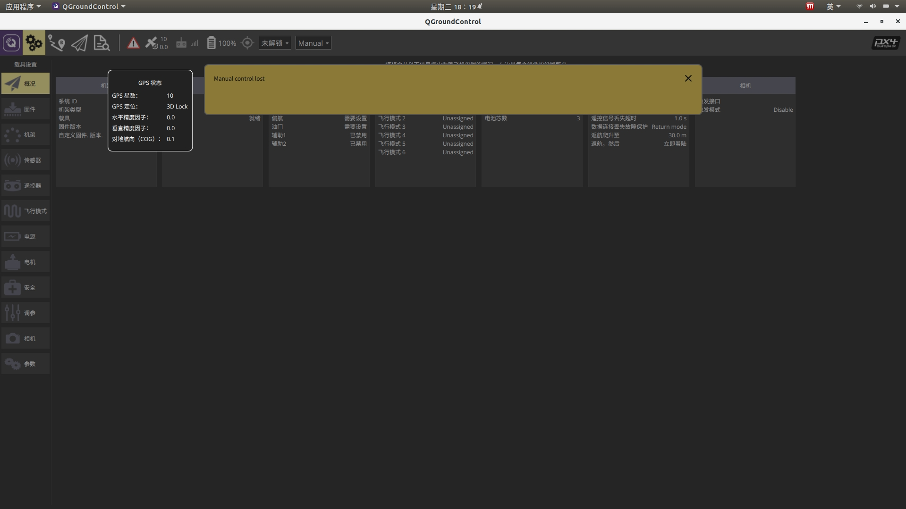
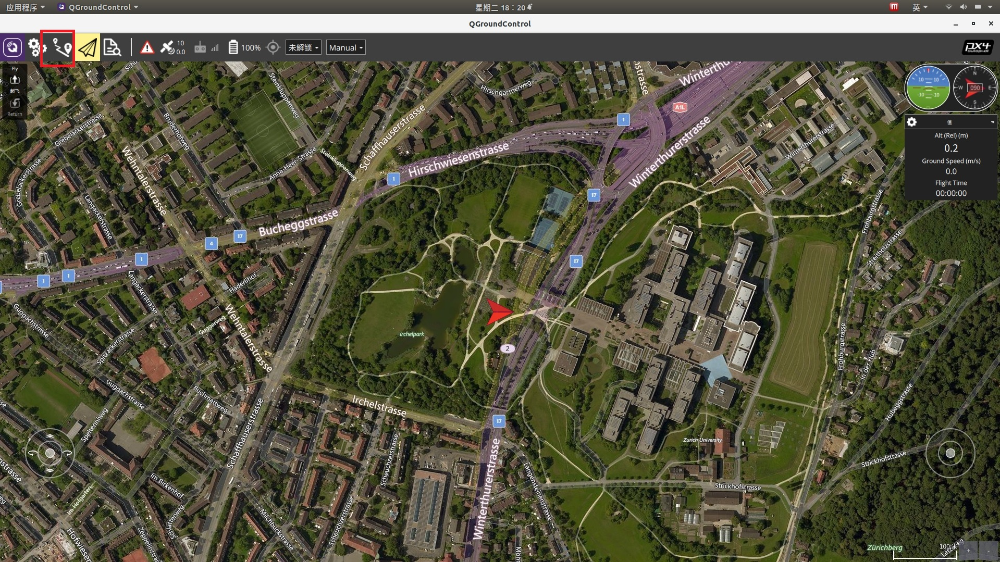

.. 硬件及软件介绍:

=====================================
硬件及软件介绍
=====================================

４.1硬件介绍
=============================

4.1.1 桨叶安装
-----------------------
桨叶：

桨叶安装前需要先区分飞机前后（有电池连接线的一端为后）：

并且安装时需要注意每个电机的转向：

后两个桨叶安装方向：

前两个桨叶安装方向：

4.1.2 飞控安装
------------------

飞控接线：

飞控与Tx2接线：

4.1.3 遥控器介绍
------------------

４.2 QGroundControl软件介绍
=============================

.. tip::

    QGC各版本请手动下载
    `QGC官网 <https://docs.qgroundcontrol.com/master/en/getting_started/download_and_install.html>`__
    提取码: **1evo**

4.2.1 QGC通信连接
-------------------

连接有两种方法，数据线连接，wifi连接

1. 数据线连接

用Micro USB插入飞控的数据口连接电脑，打开QGC即可自动进行连接

2. wifi图传连接

第一步是打开 应用程序设置 菜单栏;第二步是选择 通讯连接 侧边栏;下面会出现五个可修改功能按钮,分别为删除,编辑,添加,连接,断开连接.第三步是点击 添加 按钮.(此处图片为qgc的连接1~3)

.. image:: ../images/T265_User_Guide/TX2_series/connect_to_qgc/add_new_connect.jpg

第四步是在类型旁边将原有的类型serial重选为TCP.(此处图片为第四步)

选择TCP类型之后,下面的输入框有所变化,主机地址就填写为192.168.10.76;端口号填写为6000,接着点击确认即可.(此处照片5~7)

.. image:: ../images/T265_User_Guide/TX2_series/connect_to_qgc/write_vehicle_ip.jpg

第八步是选中刚才添加的通讯连接,第九步点击下面的连接按钮,进行连接到QGC.(此处照片为8~9)

.. image:: ../images/T265_User_Guide/TX2_series/connect_to_qgc/connect_to_qgc.jpg

第十步就可以看到WIFI数传连接成功,地面站上显示飞控的各个信息.(此处照片为10)

.. image:: ../images/T265_User_Guide/TX2_series/connect_to_qgc/wifi_connect_success.jpg

.. tip::

    关于QGC与飞机连接的详细配置，请查看第八章：无人机高级功能调试

4.2.2 QGC常规设置
------------------

连接上飞机后可以对QGC进行一些常规设置：

4.2.2 无人机飞控相关设置
----------------------------

通过图数传或数据线连接上飞控后，即可进行相关设置（无人机状态查看，传感器校准，飞控参数更改）:

.. tip::

    关于无人机传感器的校准详细配置，请查看第六章：手动飞行

4.2.3 无人机传感器状态查看
---------------------------

通过顶部的菜单栏可以查看一些基本的传感器状态:

GPS状态:

电池电量：

4.2.4 无人机航线规划
-----------------------
点击上方第三个按钮即可进入无人机航线界面创建相关航线任务：

