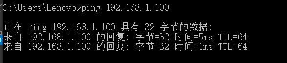
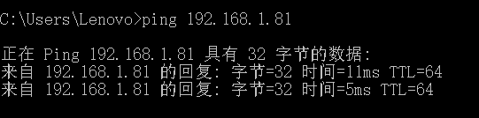
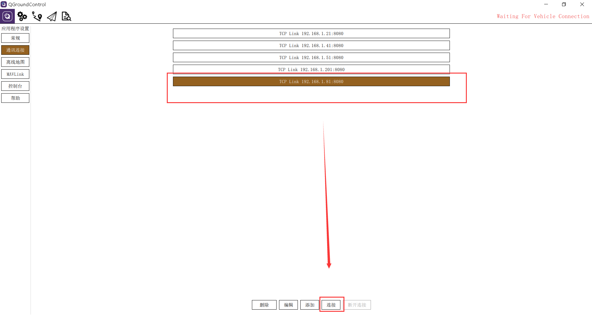
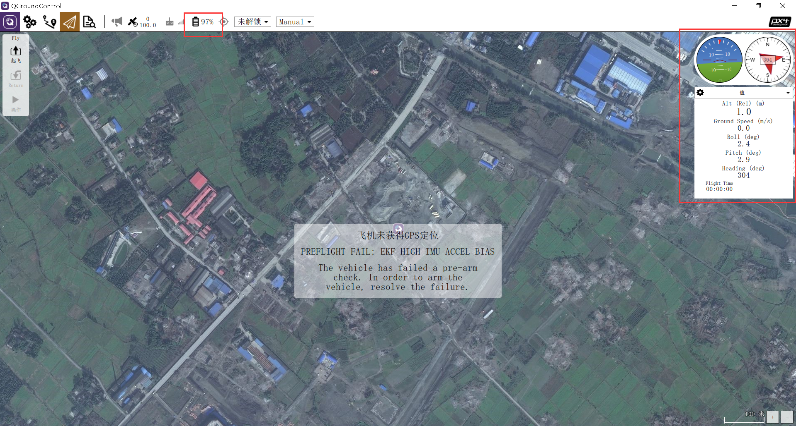
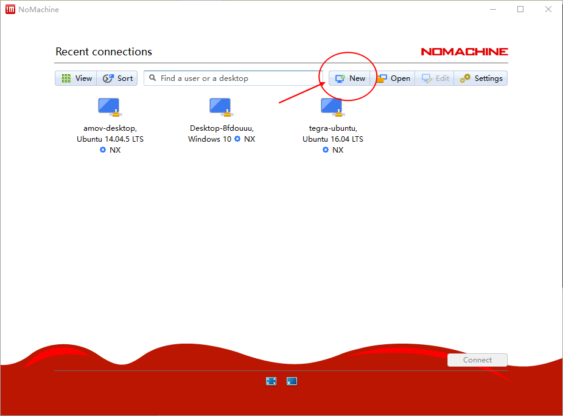

.. 无人机高级功能调试

=====================================
无人机高级功能调试
=====================================

8.1  连接飞控
=================

8.1.0 说明
-------------------
.. tip::

    如果连接失败，请看第九章教程进行数传配置检查

本套教程包含两个连接教程，一个是使用图数传进行连接，一个是使用wifi数传进行连接，请根据自己的实际配置进行连接。

8.1.1 图数传连接飞控
----------------------

飞机端图数传上面贴有标签,我这里串口1的ip为192.168.1.81 端口为8080，记录下此ip和端口供后面连接使用。

.. image:: ../images/Wifi_Air.png

首先拿到飞机之后,上电,同时将地面端图数传上电，使用网口转GH1.25 4P连接地面端与笔记本：

.. warning::

    请勿将电源线接入网口或串口，否者可能造成您的设备损坏。

.. image:: ../images/Wifi_Connect.png

然后打开一个终端,ping一下地面端图数传的IP:192.168.1.100(ping通说明笔记本与地面端连接成功)

接着ping飞机端的串口1（通常飞控连接的是飞机端图数传的串口1）：

发现已经ping成功了,说明我们可以连接到QGroundControl地面站上面了.

接着,打开QGC,第一步是打开 应用程序设置 菜单栏;第二步是选择 通讯连接 侧边栏;下面会出现五个可修改功能按钮,分别为删除,编辑,添加,连接,断开连接.第三步是点击 添加 按钮.(此处图片为qgc的连接1~3)

.. image:: ../images/QGC_Set1.png

接着添加飞机端图数传的串口1（飞控连接的接口），类型为TCP，然后点击确认即可

.. image:: ../images/QGC_Set2.png

选中刚才添加的通讯连接,第九步点击下面的连接按钮,进行连接到QGC.

可以看到WIFI数传连接成功,地面站上显示飞控的各个信息.

8.1.2 wifi数传连接飞控
-----------------------

飞机上面贴有标签,WIFI数传名字为amov-uav76.密码为amov19076.

首先拿到飞机之后,上电,打开自己电脑WIFI,选择WIFI名为amov-uav76,并输入密码进行连接.

然后打开一个终端,ping一下WIFI数传的IP,192.168.10.76.(截图为WIFI数传配置成功的图片)

发现已经ping成功了,说明我们可以连接到QGroundControl地面站上面了.

接着,打开QGC,第一步是打开 应用程序设置 菜单栏;第二步是选择 通讯连接 侧边栏;下面会出现五个可修改功能按钮,分别为删除,编辑,添加,连接,断开连接.第三步是点击 添加 按钮.(此处图片为qgc的连接1~3)

第四步是在类型旁边将原有的类型serial重选为TCP.(此处图片为第四步)

.. image:: ../images/T265_User_Guide/TX2_series/connect_to_qgc/serial_seclect_tcp.jpg

选择TCP类型之后,下面的输入框有所变化,主机地址就填写为192.168.10.76;端口号填写为6000,接着点击确认即可.(此处照片5~7)

第八步是选中刚才添加的通讯连接,第九步点击下面的连接按钮,进行连接到QGC.(此处照片为8~9)

.. image:: ../images/T265_User_Guide/TX2_series/connect_to_qgc/connect_to_qgc.jpg

第十步就可以看到WIFI数传连接成功,地面站上显示飞控的各个信息.(此处照片为10)

8.2  连接机载电脑远程桌面
=========================

8.2.0 说明
-------------------
.. tip::

    如果连接失败，请看第九章教程进行数传配置检查

本套教程包含两个连接教程，一个是使用图数传进行邻居，一个是使用wifi数传进行连接，请根据自己的实际配置进行连接。

8.2.1 图数传连接远程桌面
--------------------------
需要的硬件:

-   1. 有HDMI接口的显示器一台(用于显示TX2，TX2连接你准备好的路由器的WiFi)
-   2. 带宽比较好的路由器一台
-   3. 安装有QGC地面站与NoMachine电脑一台或两台

**NoMachine配置**:此步骤需要英伟达TX2中的Ubuntu系统使用网口转GH1.25 4P连接图数传飞机端，并在终端上输入ifconfig命令找到TX2的IP（我的TX2 IP为192.168.1.84）。
我们通常在发货前会将TX2的ip设置为静态的，比如您的飞机端图数传ip为192.168.1.80，则TX2的IP就设置为192.168.1.84
TX2连接飞机端图数传：

.. image:: ../images/TX2_WIFI.JPG

打开NOMACHINA软件，点击 New新建

Protrocol选择NX模式，然后输入TX2的IP地址192.168.1.84，Port默认4000

.. image:: ../images/NoMachine1.png

下一步，鉴定方式选择Password，下一步选择Do not use proxy，最后Done

如下选择刚才配置的参数，点击连接

.. image:: ../images/NoMachine2.png

成功后点击YES

输入TX2的用户名以及密码(默认amov) 然后一路OK即可进行访问。

.. image:: ../images//NoMachine3.png

.. image:: ../images/NoMachine4.png

8.2.1 wifi数传连接远程桌面
--------------------------

需要的硬件:

-   1. 有HDMI接口的显示器一台(用于显示TX2，TX2连接你准备好的路由器的WiFi)
-   2. 带宽比较好的路由器一台
-   3. 安装有QGC地面站与NoMachine电脑一台或两台

**NoMachine配置**:此步骤需要英伟达TX2中的Ubuntu系统连接成功WiFi数传的wifi，并在终端上输入ifconfig命令找到TX2的IP（我的TX2 IP为192.168.10.140）。

打开NOMACHINA软件，点击 New新建

Protrocol选择NX模式，然后输入TX2的IP地址192.168.10.140，Port默认4000

下一步，鉴定方式选择Password，下一步选择Do not use proxy，最后Done

如下选择刚才配置的参数，点击连接

成功后点击YES

输入TX2的用户名以及密码 然后一路OK即可进行访问。

