.. 无人机挂载设备调试

=====================================
图传配置及吊舱的使用 
=====================================
.. 一级标题

9.0 说明
==========
.. 二级标题

.. tip::

    我们的数传设备有两种，一种是WIFI数传，一种是图数传，如果是WIFI数传请看9.2节，如果是图数传请看9.1节

9.1 图数传配置
===================
.. 二级标题

9.1.0 说明
---------------
.. 三级标题

您购买收到的图数传地面端和图数传移动端(飞机端)，默认已经按照背面的IP配置连接成功，可以跳过9.1.1节和9.1.2节进行测试。

如果意外更改或其他原因，导致图数传地面端和图数传移动端连接不成功，可以按步骤依次配置。

.. tip::

    图数传的配置工具请在百度网盘自主下载
    `网盘链接 <https://pan.baidu.com/s/1jmf89LwA5vBB8o1Pp69DnQ>`__
    提取码: **1evo** 

图数传模块：

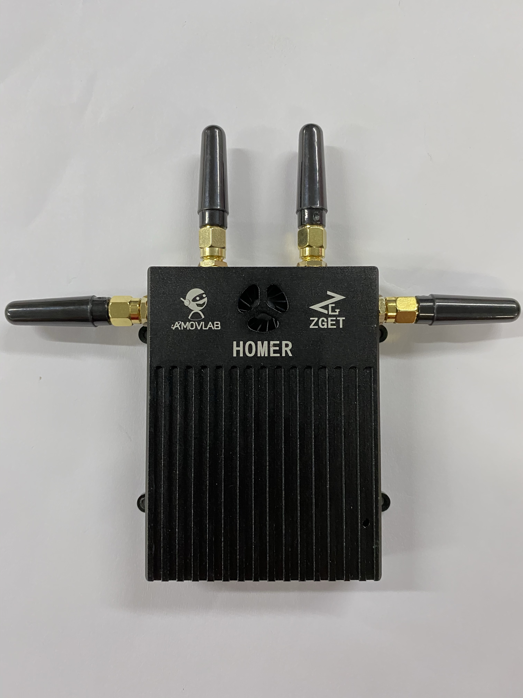

9.1.1 地面端图数传设置
-----------------------
.. 三级标题

.. image:: ../images/wifi_land.JPG
    :width: 60%
    :align: center 

发货前我们默认会将地面端配置为AP模式，其中地面端图数传会创建一个wifi热点。
通常我们配置的默认wifi名称为：amov-01,密码为：123456789 （此热点电脑搜索不到，仅图数传可搜索）

硬件连接
^^^^^^^^^^^
.. 四级标题

使用网口转GH1.25 4P线连接地面端LAN口与电脑网口

|LAN_To_4Pin|  |WIfi_Lan|

.. |LAN_To_4Pin| image:: ../images/LAN_To_4Pin.JPG
    :width: 49% 
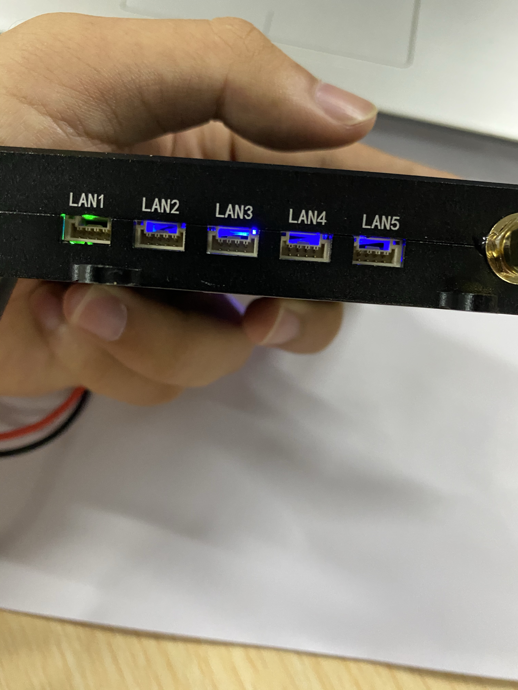

使用4s电池进行供电。使用XT30转GH1.25 4P线连接地面端图数传与4s电池。如下图所示。

|XT30To4P|  |Wifi_Power|

.. |XT30To4P| image:: ../images/XT30To4P.JPG
    :width: 49%

整体接线如下：

.. image:: ../images/Wifi_Connect.png
    :width: 100%

.. warning::

    请勿将电源线接入网口或串口，否者可能造成您的设备损坏。

软件配置
^^^^^^^^^^^^^
.. 四级标题

通电前将地面端图数传UART3(串口3)上面的开关拨到左侧（AP模式）。请勿随意拨动开关，否则可能造成配置混乱。

.. image:: ../images/Wifi_Ap.png

1. 配置电脑静态IP

按照接线将地面端上电并连入电脑网口，关闭电脑WIFI，打开网络链接，双击以太网：

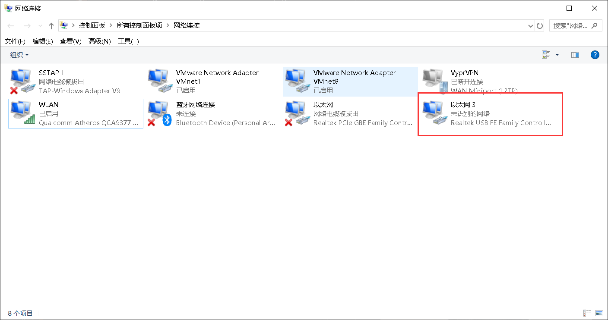

在属性->找到IPV4选项并双击：

.. image:: ../images/Wifi_NetWork2.png

配置静态IP为192.168.1.x,子网掩码为255.255.255.0,网关为192.168.1.1：

.. image:: ../images/Wifi_NetWork3.png

设置完成后依次点击每个窗口的确定按钮进行关闭。

2. 配置图数传串口

图数传模块有三个串口，如果要使用这些串口，就需要在配置软件中进行配置。

打开网盘中提供的配置软件（ZLVirCom5.42.exe）。点击设备管理：

.. image:: ../images/Wifi_VIr1.png

配置每个串口的IP以及波特率等信息： 

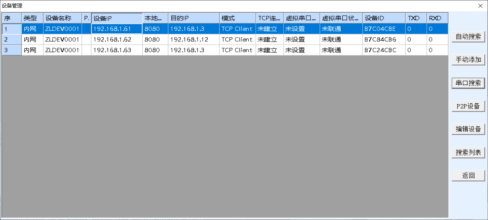

这里对UART1(串口1)的配置如下图所示：

.. image:: ../images/Wifi_Urt_Conf1.png

UART2(串口2)：

.. image:: ../images/Wifi_Urt_Conf2.png

UART3(串口3)：

.. image:: ../images/Wifi_Urt_Conf3.png

配置之后点击修改设置即可，配置之后显示如下：

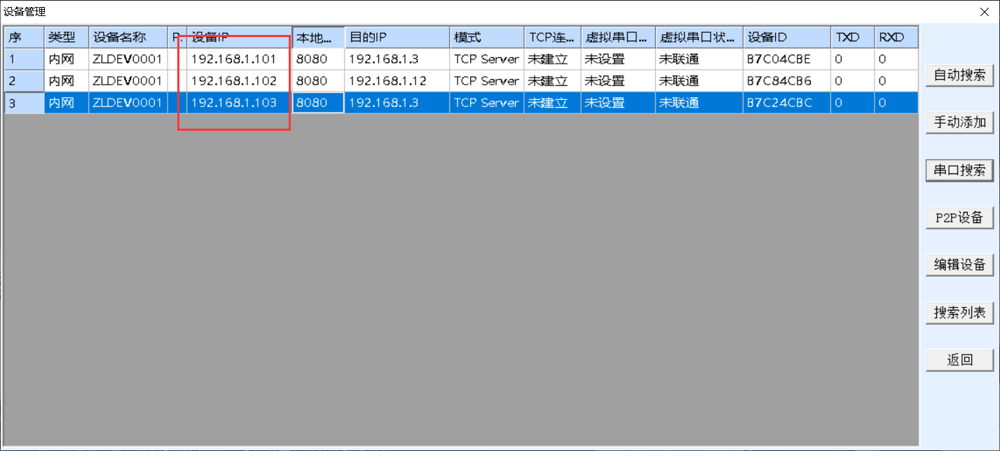

3. 配置图数传WIFI

根据图数传底下提供的IP,在浏览器地址栏输入该IP(一般地面端AP模式的IP均为192.168.1.100):

.. image:: ../images/Wifi_Conf1.JPG
    :width: 70%
    :align: center

进入配置网页进行登陆，用户名密码均为admin：

.. image:: ../images/Wifi_Conf2.JPG

登陆后可以看到当前模式为AP模式。点击Wireless:

.. image:: ../images/Wifi_Conf3.JPG

设置WIFI以及密码：

.. image:: ../images/Wifi_Conf4.JPG

之后点击Save保存。

9.1.2 飞机端图数传设置
-----------------------

.. image:: ../images/Wifi_Air.png
    :width: 70%
    :align: center
飞机端图数传在我们发货前也会默认配置为无线STA模式，并且连接上地面端的wifi。
通常您拿到手的图数传已经是配置好的。

硬件连接
^^^^^^^^^^^
.. 四级标题

同地面端

软件配置
^^^^^^^^^^^
.. 四级标题

通电前将飞机端图数传UART3(串口3)上面的开关拨到右侧（STA）。

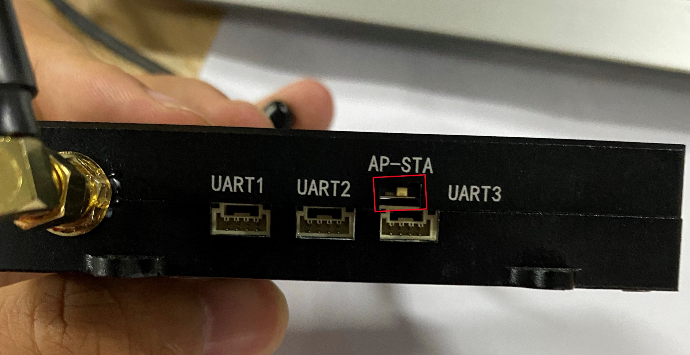

1. 配置电脑静态IP

同地面端

2. 配置图数传串口

图数传模块有三个串口，如果要使用这些串口，就需要在配置软件中进行配置。

.. image:: ../images/Wifi_Urt.JPG

打开网盘中提供的配置软件（ZLVirCom5.42.exe）
点击设备管理：

.. image:: ../images/Wifi_VIr1.png

配置每个串口的IP以及波特率等信息： 

这里我配置UART1(串口1)为如下：

.. image:: ../images/Wifi_Urt_Conf5.png

UART2(串口2)：

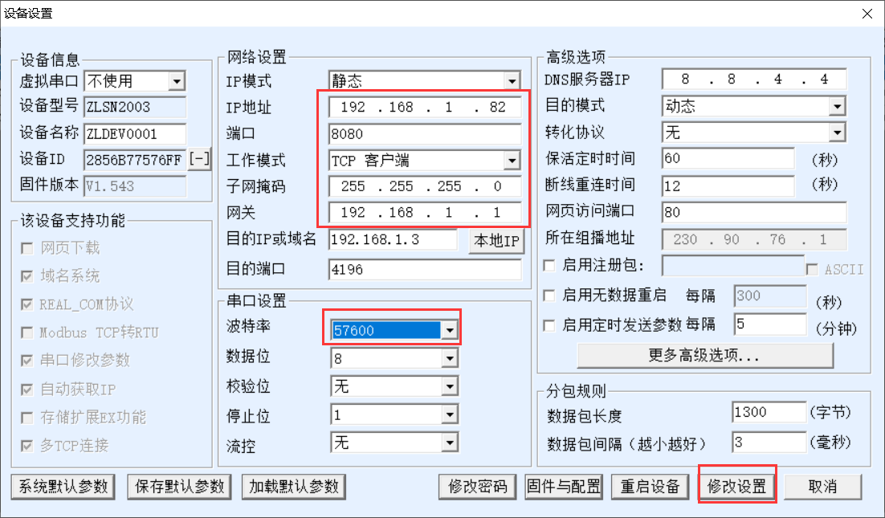

UART3(串口3)：

.. image:: ../images/Wifi_Urt_Conf9.png

配置之后点击修改设置即可，配置之后显示如下：

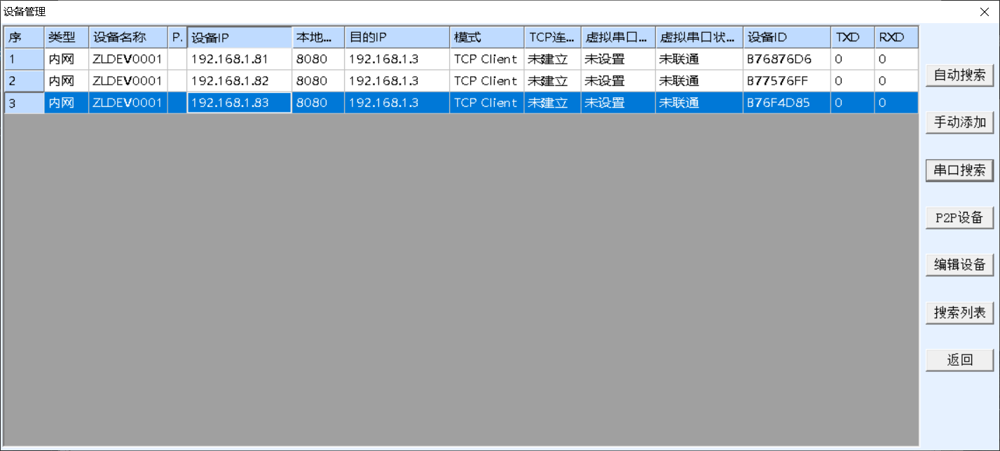

3. 配置图数传WIFI

根据图数传底下提供的IP，在浏览器地址栏输入该IP。当图数传在STA模式下，如果该设备上贴有数字xx，则该设备的IP为192.168.1.xx。
例如，该设备贴有数字80，则该设备的IP为192.168.1.80。

.. image:: ../images/Wifi_Sta_Ip.png

进入配置网页进行登陆，用户名密码均为admin：

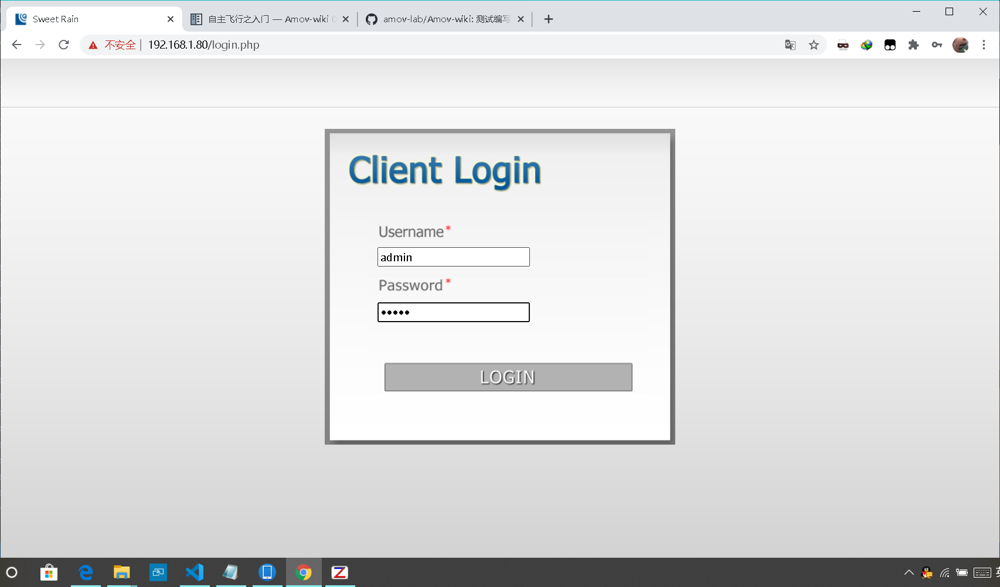

登陆后可以看到当前模式为STA模式，点击Wireless:

.. image:: ../images/Wifi_Sta_Conf2.png

选择Scan扫描Wifi：

.. image:: ../images/Wifi_Sta_Conf3.png

将地面端上电，并选中地面端WIFI填入密码，点击Connect:

.. image:: ../images/Wifi_Sta_Conf4.png

接下来测试是否配置成功：重启图数传地面端和飞机端，假设你配置成功，
那么飞机端图数传会自动连接地面端图数传。那么我们将笔记本连接上地面端网口，
打开终端(cmd)，分别ping 192.168.1.80,192.168.1.81,192.168.1.82，192.168.1.83
尝试ping一下我们的飞机端图数传的几个串，都ping通了，那么恭喜你搞定了，
ping不通那么你需要打开需要检查上面的配置是否有错误。 

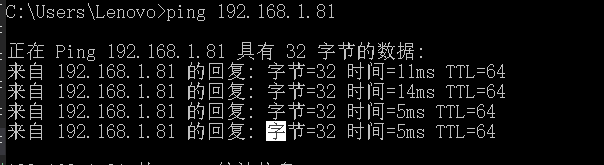

9.2 WIFI数传配置
===================

9.2.1 WiFi数传两种配置模式
--------------------------

.. tip::

    WiFi数传的配置工具请在百度网盘自主下载
    `网盘链接 <https://pan.baidu.com/s/1t1zp2y1ikBSsJC8DNLjY_g>`_
    
    提取码: **exk3**

根据WiFi-LINK配置模式有两种连接方式：一种是无线AP模式,另外一种无线网卡模式.出厂默认配置为AP模式,如需配置为无线网卡模式,可按照无线网卡模式说明文档自行配置

WIFI-LINK配置成无线AP模式
"""""""""""""""""""""""""""""""

.. image:: ../images/XBEE_AP_mode.png

这是我们发货时的默认配置，其中WiFi-LINK模块相当与一个热点，笔记本2要连接这个热点进而连接QGC.
他们配置详细步骤请看WIFI数传远程连接QGroundControl非正常连接篇

WiFi-LINK配置成无线网卡模式
""""""""""""""""""""""""""""""""

.. image:: ../images/XBEE_WLAN_mode.png

**路由器设置**

如图为无线WiFi路由器，其默认IP地址为192.168.10.1，
登录到此路由器的后台，用已连接此WiFi的手机或电脑
登陆地址wifi.wavlink.com（默认密码为admin）。

WIFI设置：设置WiFi的名称（此名称会在数传设置中用到）
加密方式选择WPA2-PSK

.. image:: ../images/WLAN_picture.jpg

**WiFi数传设置**

-   硬件连接

可用四根杜邦线连接usb转TTL与WiFi-LINK，下图是线序

-   软件配置

打开配置软件RM08K config tool CN V2.1.exe

.. image:: ../images/WIFI_RM08K_config.png

选择相应的COM口使用一个细长的金属棒或者牙签点击WiFi数传
模块的reset按钮（模块上远离天线的那个孔），然后点击搜索
模块按钮，软件显示如下（Found Device at COMX(57600)）
说明连接成功。

.. image:: ../images/WIFI_RM08K_serch_uart.png

然后下图所示配置你们的WiFi数传，其中网关要选择你的路由器
的网段，网络名称及密码设置你的WiFi路由器的名称与密码，
其中加密方式选择WPA2_AES。

设置完成后点击提交配置即可。

接下来测试是否配置成功：重启WiFi数传，假设你配置成功，
那么WiFi数传会自动连接WiFi路由器。那么我们用连接此
WiFi路由器的笔记本，打开终端(cmd)，输入ping 192.168.10.105 
尝试ping一下我们的WiFi数传，ping通了，那么恭喜你搞定了，
ping不通那么你需要打开 RM08K config tool CN V2.1.exe 
重新配置一下，可以点击查询配置，看看配置的是否有出入。

.. image:: ../images/WIFI_RM08K_set_success.png

9.3 吊舱使用
===================

我们通过局域网，使TX2和自己的笔记本电脑连接同一个WiFi，查看TX2的IP地址，首先需要无限键鼠，
HDMI转接线，显示器一台，4s电池，TX2供电线，吊舱供电电池3s。

远程连接TX2
--------------------------

首先用4S电池，TX2供电线给TX2供电开机，插上HDMI到显示器上，无线键鼠插到tx2 USB接口上面。
开机之后输入密码，账户名和密码是一致的，比如账户是nvidia，那么密码也是nvidia。
登录进去连接到WiFi，确保nomachine软件是打开的（打开的话，在右上角会有显示nomachine的图标）。然后TX2
连接WiFi，接着查看TX2当前的IP地址，打开一个终端（ Ctrl+Alt+t ），输入ifconfig，找到wanlx （ x，可
能为0，可能为1 ），可以看到inet addr：xxx.xxx.xxx.xxx，这些xxx表示的就是IP地址，比如我显示的
就是192.168.31.20。然后记住这个IP地址，HDMI线可以从tx2拔下来，无限键鼠可以拔掉，tx2两个
USB 口一个口接吊舱的视频 USB 口，另一个接吊舱的串口转 TTL 接口。

接下来，用自己的电脑，确保自己
电脑已经安装了nomachine软件，自己电脑WiFi也连接上和TX2一样的WiFi，打开nomachine，新建一
个连接，输入所要连接客户端的IP地址，我这里就是192.168.31.20。新建连接过程中保持默认参数。
新建完成后，双击刚新建的连接，提示是否要连接，选择连接。输入相应的账户名和密码，回车就可
以远程控制 tx2 了。

打开NOMACHINA软件，点击 New新建

.. image:: ../images/WIFI_nomachine_create_new.png

Protrocol选择NX模式，然后输入TX2的IP地址192.168.1.84，Port默认4000

.. image:: ../images/NoMachine1.png

下一步，鉴定方式选择Password，下一步选择Do not use proxy，最后Done

如下选择刚才配置的参数，点击连接

.. image:: ../images/NoMachine2.png

成功后点击YES

输入TX2的用户名以及密码(默认amov) 然后一路OK即可进行访问。

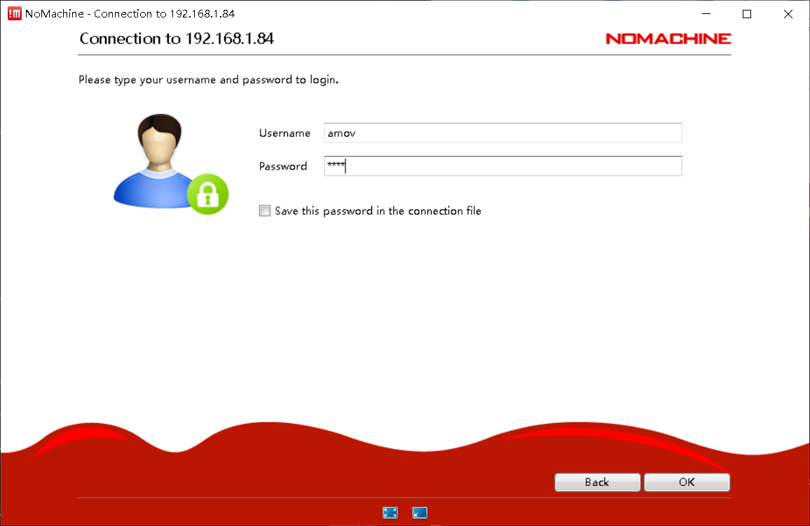

.. image:: ../images/NoMachine4.png

吊舱跟踪说明
--------------------------

吊舱的所有用到的源代码都在track_ws文件夹下面，分别是fv_tracking px4_command
serial_ros，fv_tracking文件夹里面包含了吊舱的视觉框选实现，serial_ros该文件夹包含了视觉框选的结
那反馈到吊舱imu，并对吊舱进行相应的控制跟踪，px4_command该文件包含了由吊舱控制的运动，
已经视觉框选像素大小，对飞机进行相应的控制。（该吊舱的代码不建议和P200代码混用，如果要肯定
现P200的功能，请使用P200的代码包），吊舱的源码都在track_ws下面，确保要source track_ws该文
单的路径，可以在~/.bashrc查看是否source正确。

吊舱跟踪使用过程
--------------------------

**编译源码**

通过远程连接tx2进入到TX2中。打开一个终端输入ls /dev |grep ttyUSB该命令查看当前USB设备，如
那有ttyUSB0，那无需修改任何，如果是ttyUSB1，那么你需要修改
~/track_ws/src/serial_ros/src/serial_node.cpp中找到ser.setPort这行，把这里串口改为
/dev/ttyUSB1。默认打开串口是ttyUSB0，如果你查看自己的USB设备是ttyUSB1，就需要在这里修改
一下。保存之后需要编译，编译需要到~/track_ws/目录下面，执行命令catkin_make。第二个查看自
己有没有视频设备，查看自己的/dev下面是否有/dev/videox （ x表示0或者1 ），如果/dev下面没
有/dev/videox相关的设备，请重新启动一下吊舱供电，重新查看/dev应该会有/dev/videox。x为0就是
默认，无需修改，如果x是1，那么需要修改~/track_ws/src/fv_tracking/nodes/web_cam.cpp。查找
cv：：VideoCapture默认使用的是摄像头0，如果上面x为1，则这里摄像头选择也要改为1 .同理需要保存
和编译，编译还是需要在~/track_ws/目录下面执行catkin_make进行编译。

**启动吊舱脚本**

1. 首先使用Nomachine连接TX2的远程桌面。

.. image:: ../images/TX2_Remote.png

2. 接着运行如下目录的脚本文件：
/home/amov/track_ws/src/px4_command/sh/sh_for_P200/fly_tracking_test.sh

.. image:: ../images/TX2_1.png

3. 会运行五个终端，依次检查每个终端是否有报错，这里第二个终端报错（打不开视频）：

.. image:: ../images/Track_Con1.png

4. 请确保吊舱电源是否开启，并且吊舱的USB线插入TX2,通常在TX2上电后需要重启下吊舱，否者可能造成TX2连接不上吊舱，
插拔吊舱电源重新上电

5. 再次运行脚本,运行成功:

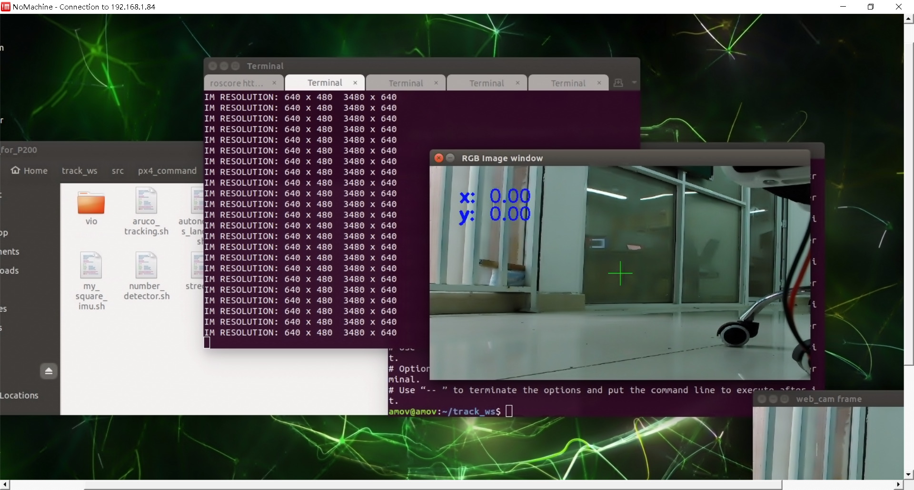

6. 框选一个物体，测试吊舱是否能够跟踪：

.. image:: ../images/Track_Test.png

