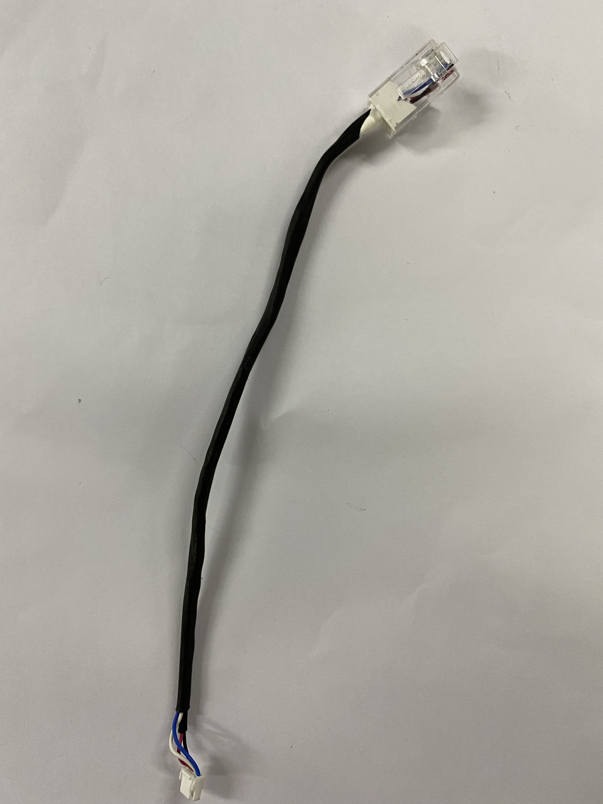
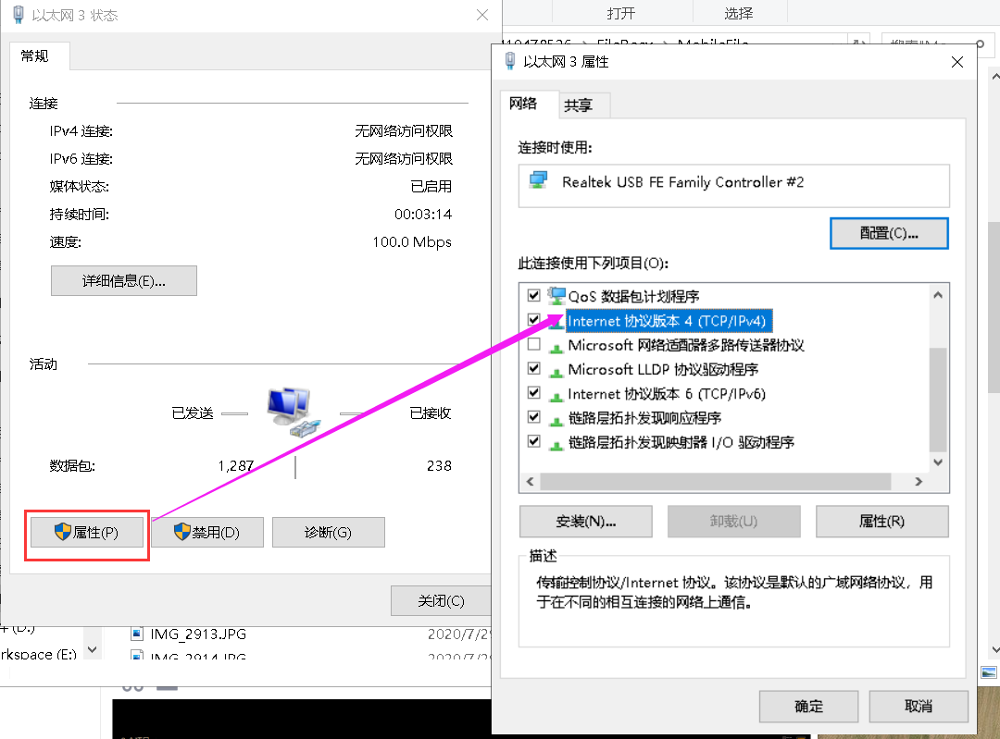
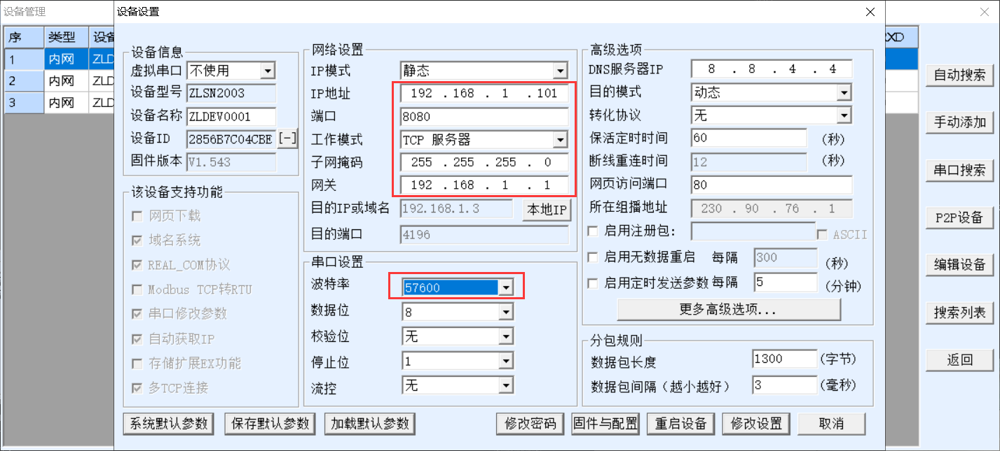
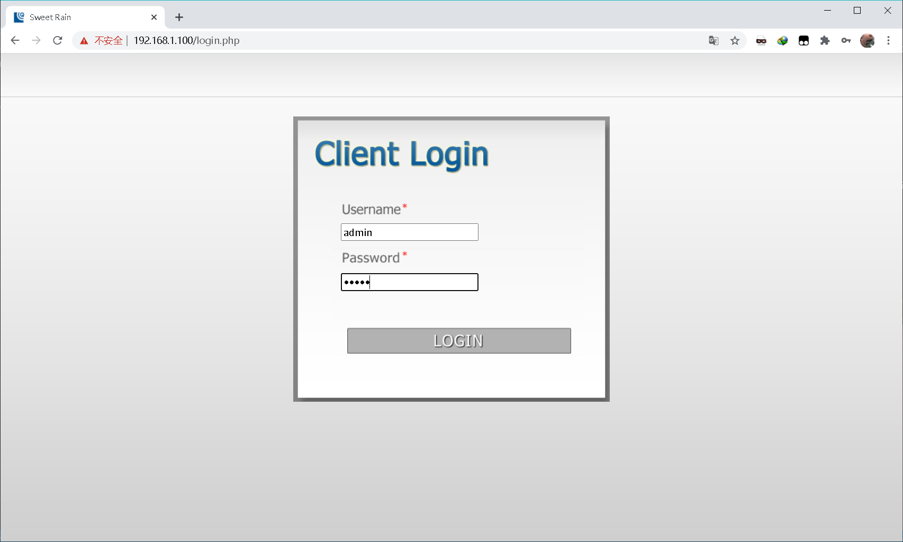
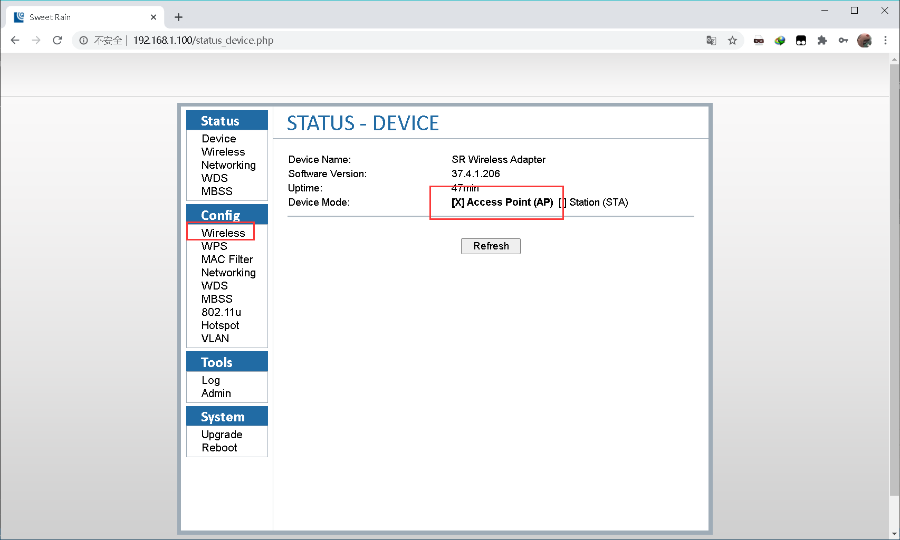
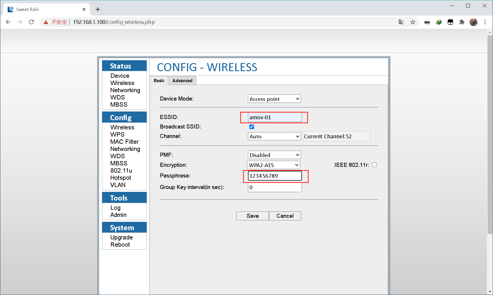

.. 无人机挂载设备调试:

=====================================
无人机挂载设备调试
=====================================

9.0 说明
========

.. tip::

    我们的数传设备有两种，一种是WIFI数传，一种是图数传，如果是WIFI数传请看9.1节，如果是图数传请看9.2节

9.1 图数传配置
===================

9.1.0 说明
---------------
您购买收到的图数传地面端和图数传移动端，默认已经按照背面的IP配置连接成功，可以跳过9.1.1节和9.1.2节进行测试。

如果意外更改或其他原因，导致图数传地面端和图数传移动端连接不成功，可以按步骤依次配置。

.. tip::

    图数传的配置工具请在百度网盘自主下载
    `网盘链接 <https://pan.baidu.com/s/1jmf89LwA5vBB8o1Pp69DnQ>`__
    提取码: **1evo**

图数传模块：
.. image:: ../images/WIFI_IMAGE_model.png

9.1.1 地面端图数传设置
-----------------------

我们发货前默认会将地面端配置为AP模式，其中地面端图数传会创建一个wifi热点，
通常我们配置的默认wifi名称为：amov-01,密码为：123456789 （此热点电脑搜索不到，仅图数传可搜索）

- 硬件连接

使用网口转GH1.25 4P连接地面端LAN口与电脑网口

.. image:: ../images/WIfi_Lan.png

使用XT30转GH1.25 4P连接地面端与4s电池进行供电

.. image:: ../images/XT30To4P.JPG

.. image:: ../images/Wifi_Power.png

整体接线如下：

.. image:: ../images/Wifi_Connect.png

.. warning::

    请勿将电源线接入网口或串口，否者可能造成您的设备损坏。

-软件配置

通电前将地面端图数传串口3上面的开关拨到左侧（AP）请勿随意拨动开关，可能造成配置混乱。

.. image:: ../images/Wifi_Ap.png

1. 配置电脑静态IP

按照接线将地面端上电并连入电脑网口，关闭电脑WIFI，打开网络链接，双击以太网：

.. image:: ../images/WIfi_NetWork1.png

在属性->找到IPV4选项并双击：

配置静态IP为192.168.1.x,子网掩码为255.255.255.0,网关为192.168.1.1：

.. image:: ../images/Wifi_NetWork3.png

设置完成后依次点击每个窗口的确定按钮进行关闭。

2. 配置图数传串口

图数传模块有三个串口，如果要使用这些串口，就需要在配置软件中进行配置

打开网盘中提供的配置软件（ZLVirCom5.42.exe）
点击设备管理：

.. image:: ../images/Wifi_VIr1.png

配置每个串口的IP以及波特率等信息： 

.. image:: ../images/Wifi_Vir2.png

这里我配置串口1为如下：

串口2：

.. image:: ../images/Wifi_Urt_Conf2.png

串口3：

.. image:: ../images/Wifi_Urt_Conf3.png

配置之后点击修改设置即可，配置之后显示如下：

.. image:: ../images/Wifi_Urt_Conf4.png

3. 配置图数传WIFI

根据图数传底下提供的IP,在浏览器地址栏输入该IP(一般地面端AP模式的IP均为192.168.1.100):

.. image:: ../images/Wifi_Conf1.JPG

进入配置网页进行登陆，用户名密码均为admin：

登陆后可以看到当前模式为STA模式，点击Wireless:

设置WIFI以及密码：

之后点击Save保存

9.1.1 飞机端图数传设置
-----------------------

.. image:: ../images/Wifi_Air.png

飞机端图数传在我们发货前也会默认进行配置为无线STA模式，并连接上地面端的wifi，并经过测试，
通常您拿到手的图数传已经是配置好了。

- 硬件连接

同地面端

- 软件配置

通电前将飞机端图数传串口3上面的开关拨到左侧（STA）。

.. image:: ../images/Wifi_Sta.JPG

1. 配置电脑静态IP

同地面端

2. 配置图数传串口

图数传模块有三个串口，如果要使用这些串口，就需要在配置软件中进行配置

.. image:: ../images/Wifi_Urt.JPG

打开网盘中提供的配置软件（ZLVirCom5.42.exe）
点击设备管理：

.. image:: ../images/Wifi_VIr1.png

配置每个串口的IP以及波特率等信息： 

.. image:: ../images/Wifi_Vir2.png

这里我配置串口1为如下：

.. image:: ../images/Wifi_Urt_Conf5.png

串口2：

.. image:: ../images/Wifi_Urt_Conf6.png

串口3：

.. image:: ../images/Wifi_Urt_Conf9.png

配置之后点击修改设置即可，配置之后显示如下：

.. image:: ../images/Wifi_Urt_Conf8.png

3. 配置图数传WIFI

根据图数传底下提供的IP,在浏览器地址栏输入该IP:

.. image:: ../images/Wifi_Sta_Ip.png

进入配置网页进行登陆，用户名密码均为admin：

.. image:: ../images/Wifi_Sta_Conf1.png

登陆后可以看到当前模式为AP模式，点击Wireless:

.. image:: ../images/Wifi_Sta_Conf2.png

选择Scan扫描Wifi：

.. image:: ../images/Wifi_Sta_Conf3.png

将地面端上电，并选中地面端WIFI填入密码，点击Connect:

.. image:: ../images/Wifi_Sta_Conf4.png

接下来测试是否配置成功：重启图数传地面端和飞机端，假设你配置成功，
那么飞机端图数传会自动连接地面端图数传。那么我们将笔记本连接上地面端网口，
打开终端(cmd)，分别ping 192.168.1.80,192.168.1.81,192.168.1.82，192.168.1.83
尝试ping一下我们的飞机端图数传的几个串，都ping通了，那么恭喜你搞定了，
ping不通那么你需要打开需要检查上面的配置是否有错误。 

.. image:: ../images/Ping_Sucess.png

9.2 WIFI数传配置
===================

9.2.1 WiFi数传两种配置模式
--------------------------

.. tip::

    WiFi数传的配置工具请在百度网盘自主下载
    `网盘链接 <https://pan.baidu.com/s/1t1zp2y1ikBSsJC8DNLjY_g>`_
    
    提取码: **exk3**

根据WiFi-LINK配置模式有两种连接方式：一种是无线AP模式,另外一种无线网卡模式.出厂默认配置为AP模式,如需配置为无线网卡模式,可按照无线网卡模式说明文档自行配置

WIFI-LINK配置成无线AP模式
"""""""""""""""""""""""""""""""

.. image:: ../images/XBEE_AP_mode.png

这是我们发货时的默认配置，其中WiFi-LINK模块相当与一个热点，笔记本2要连接这个热点进而连接QGC.
他们配置详细步骤请看WIFI数传远程连接QGroundControl非正常连接篇

WiFi-LINK配置成无线网卡模式
""""""""""""""""""""""""""""""""

**路由器设置**

如图为 无线WiFi路由器默认IP地址为192.168.10.1，
登录到此路由器的后台，用已连接此WiFi的手机或电脑
登陆地址wifi.wavlink.com（默认密码为admin）。

WIFI设置：设置WiFi的名称（此名称会在数传设置中用到）
加密方式选择WPA2-PSK

.. image:: ../images/WIFI_setting.png

**WiFi数传设置**

-   硬件连接

.. image:: ../images/WIFI_USB_TTL.png

.. image:: ../images/WIFI_connect_computer.png

可用四根杜邦线连接usb转TTL与WiFi-LINK，下图是线序

.. image:: ../images/WIFI_USB_TTL_connect.jpg

-   软件配置

打开配置软件RM08K config tool CN V2.1.exe

选择相应的COM口使用一个细长的金属棒或者牙签点击WiFi数传
模块的reset按钮（模块上远离天线的那个孔），然后点击搜索
模块按钮，软件显示如下（Found Device at COMX(57600)）
说明连接成功。

然后下图所示配置你们的WiFi数传，其中网关要选择你的路由器
的网段，网络名称及密码设置你的WiFi路由器的名称与密码，
其中加密方式选择WPA2_AES。

设置完成后点击提交配置即可。

接下来测试是否配置成功：重启WiFi数传，假设你配置成功，
那么WiFi数传会自动连接WiFi路由器。那么我们用连接此
WiFi路由器的笔记本，打开终端(cmd)，输入ping 192.168.10.105 
尝试ping一下我们的WiFi数传，ping通了，那么恭喜你搞定了，
ping不通那么你需要打开 RM08K config tool CN V2.1.exe 
重新配置一下，可以点击查询配置，看看配置的是否有出入。

.. image:: ../images/WIFI_RM08K_set_success.png

