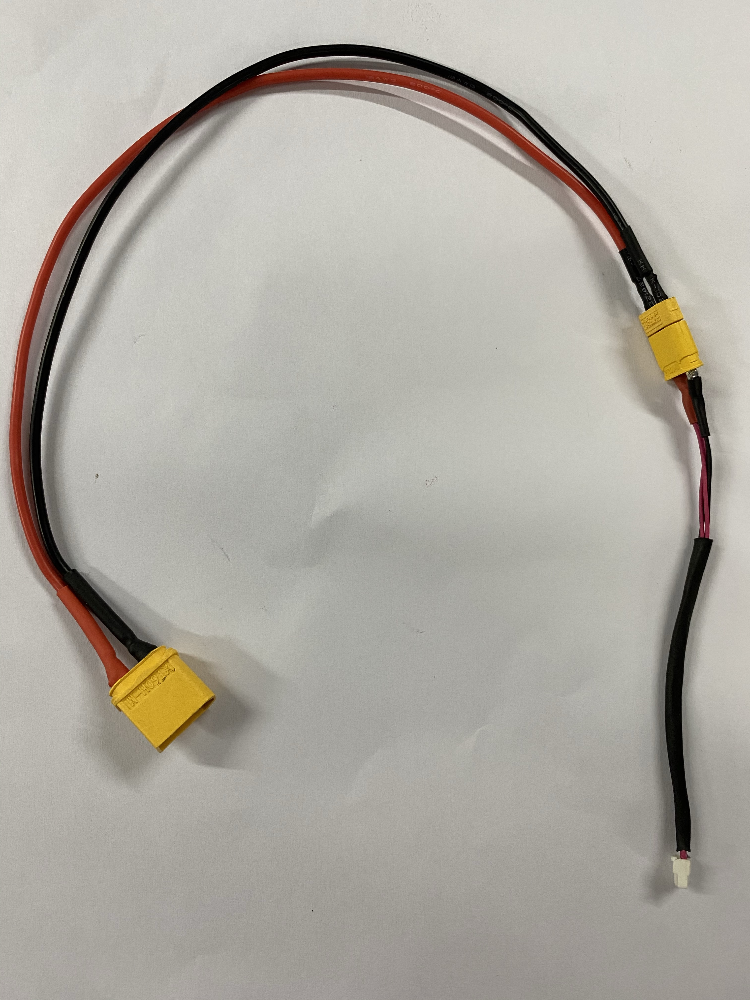
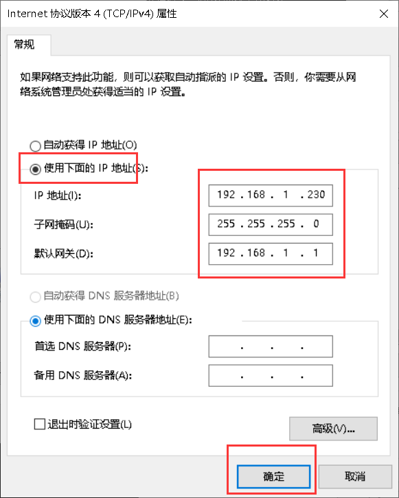
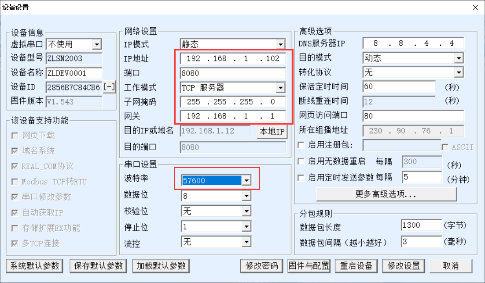
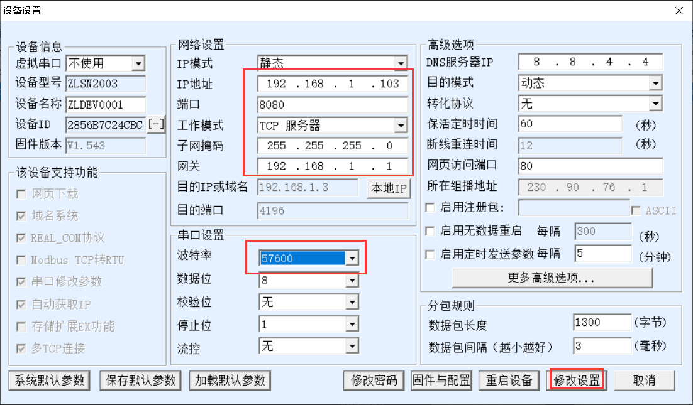
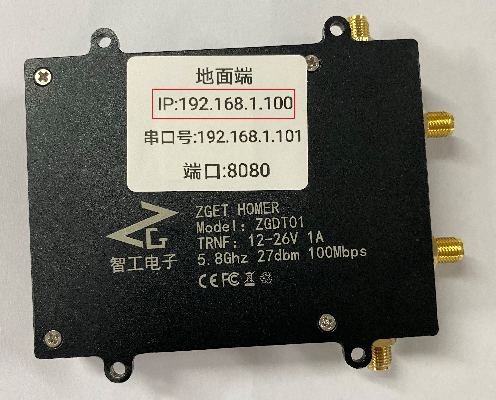
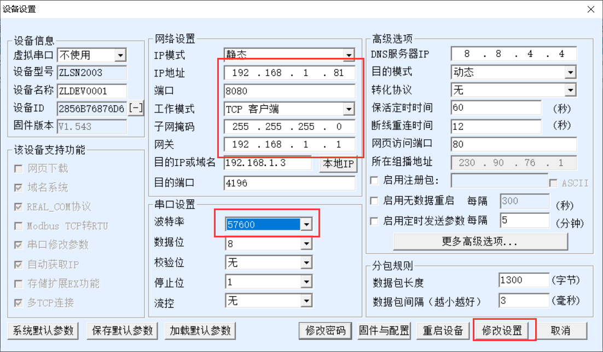
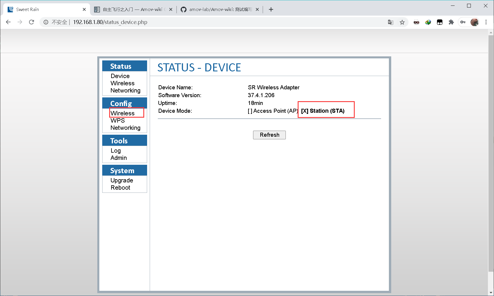
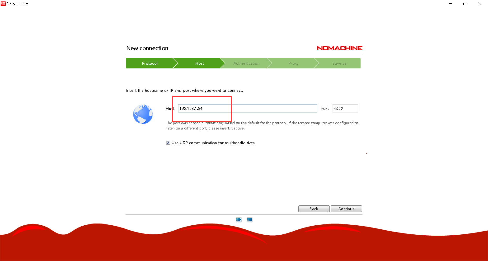
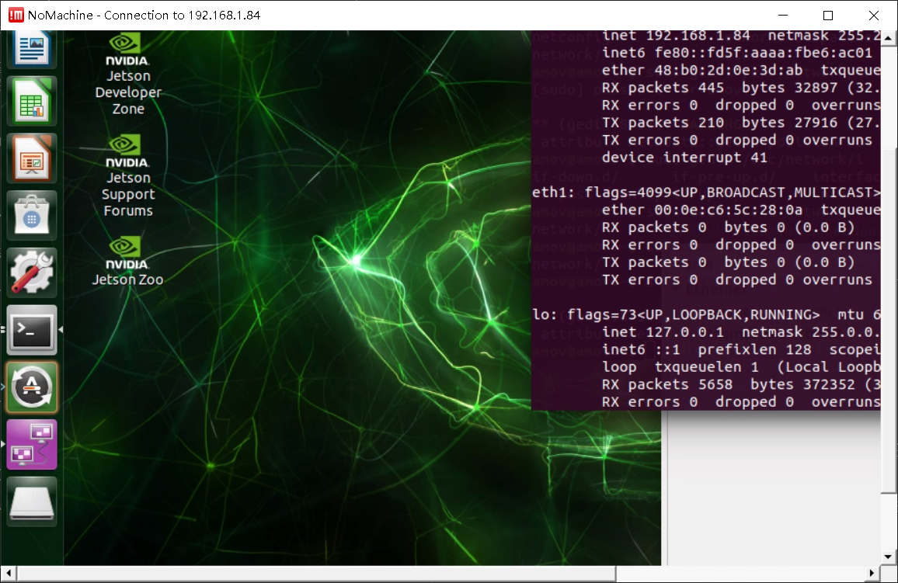

.. 图数传远程桌面连接设置:

=====================================
第七章   图数传远程桌面连接设置
=====================================

7.0 说明
========
您购买收到的图数传地面端和图数传移动端，默认已经按照背面的IP配置连接成功，可以跳过7.1节和7.2节进行测试。

如果意外更改或其他原因，导致图数传地面端和图数传移动端连接不成功，可以按步骤依次配置。

.. tip::

    图数传的配置工具请在百度网盘自主下载
    `网盘链接 <https://pan.baidu.com/s/1jmf89LwA5vBB8o1Pp69DnQ>`__
    提取码: **1evo**

7.1 图数传地面端配置
========

- 硬件连接

使用网口转GH1.25 4P连接地面端LAN口与电脑网口

.. image:: ../images/LAN_To_4Pin.JPG

.. image:: ../images/WIfi_Lan.png

使用XT30转GH1.25 4P连接地面端与4s电池进行供电

.. image:: ../images/Wifi_Power.png

整体接线如下：

.. image:: ../images/Wifi_Connect.png

.. warning::

    请勿将电源线接入网口或串口，否者可能造成您的设备损坏。

-软件配置

通电前将地面端图数传串口3上面的开关拨到左侧（AP）请勿随意拨动开关，可能造成配置混乱。

.. image:: ../images/Wifi_Ap.png

1. 配置电脑静态IP

按照接线将地面端上电并连入电脑网口，关闭电脑WIFI，打开网络链接，双击以太网：

.. image:: ../images/WIfi_NetWork1.png

在属性->找到IPV4选项并双击：

.. image:: ../images/Wifi_NetWork2.png

配置静态IP为192.168.1.x,子网掩码为255.255.255.0,网关为192.168.1.1：

设置完成后依次点击每个窗口的确定按钮进行关闭。

2. 配置图数传串口

图数传模块有三个串口，如果要使用这些串口，就需要在配置软件中进行配置

打开网盘中提供的配置软件（ZLVirCom5.42.exe）
点击设备管理：

.. image:: ../images/Wifi_VIr1.png

配置每个串口的IP以及波特率等信息： 

.. image:: ../images/Wifi_Vir2.png

这里我配置串口1为如下：

.. image:: ../images/Wifi_Urt_Conf1.png

串口2：

串口3：

配置之后点击修改设置即可，配置之后显示如下：

.. image:: ../images/Wifi_Urt_Conf4.png

3. 配置图数传WIFI

根据图数传底下提供的IP,在浏览器地址栏输入该IP(一般地面端AP模式的IP均为192.168.1.100):

进入配置网页进行登陆，用户名密码均为admin：

.. image:: ../images/Wifi_Conf2.JPG

登陆后可以看到当前模式为STA模式，点击Wireless:

.. image:: ../images/Wifi_Conf3.JPG

设置WIFI以及密码：

.. image:: ../images/Wifi_Conf4.JPG

之后点击Save保存

7.2 连接图数传移动端和图数传地面端
==============

- 硬件连接

同地面端

- 软件配置

通电前将飞机端图数传串口3上面的开关拨到左侧（STA）。

.. image:: ../images/Wifi_Sta.JPG

1. 配置电脑静态IP

同地面端

2. 配置图数传串口

图数传模块有三个串口，如果要使用这些串口，就需要在配置软件中进行配置

.. image:: ../images/Wifi_Urt.JPG

打开网盘中提供的配置软件（ZLVirCom5.42.exe）
点击设备管理：

.. image:: ../images/Wifi_VIr1.png

配置每个串口的IP以及波特率等信息： 

.. image:: ../images/Wifi_Vir2.png

这里我配置串口1为如下：

串口2：

.. image:: ../images/Wifi_Urt_Conf6.png

串口3：

.. image:: ../images/Wifi_Urt_Conf9.png

配置之后点击修改设置即可，配置之后显示如下：

.. image:: ../images/Wifi_Urt_Conf8.png

3. 配置图数传WIFI

根据图数传底下提供的IP,在浏览器地址栏输入该IP:

.. image:: ../images/Wifi_Sta_Ip.png

进入配置网页进行登陆，用户名密码均为admin：

.. image:: ../images/Wifi_Sta_Conf1.png

登陆后可以看到当前模式为AP模式，点击Wireless:

选择Scan扫描Wifi：

.. image:: ../images/Wifi_Sta_Conf3.png

将地面端上电，并选中地面端WIFI填入密码，点击Connect:

.. image:: ../images/Wifi_Sta_Conf4.png

接下来测试是否配置成功：重启图数传地面端和飞机端，假设你配置成功，
那么飞机端图数传会自动连接地面端图数传。那么我们将笔记本连接上地面端网口，
打开终端(cmd)，分别ping 192.168.1.80,192.168.1.81,192.168.1.82，192.168.1.83
尝试ping一下我们的飞机端图数传的几个串，都ping通了，那么恭喜你搞定了，
ping不通那么你需要打开需要检查上面的配置是否有错误。 

.. image:: ../images/Ping_Sucess.png

7.3 配置移动端
==============

1.将图数传移动端用与移动端连接，图数传地面端用与PC端连接。

2.进入移动端系统，禁用无线网络，设置以太网的固定IP到192.168.1.x网段，例如下图
     .. image:: ../images/yczm13.jpg

3.打开终端依次ping图数传移动端、图数传地面端、PC端，测试连接；ping通说明连接正常。
     .. image:: ../images/yczm14.jpg

7.4 添加远程桌面
==============

需要的硬件:

-   1. 有HDMI接口的显示器一台(用于显示TX2，TX2连接你准备好的路由器的WiFi)
-   2. 带宽比较好的路由器一台
-   3. 安装有QGC地面站与NoMachine电脑一台或两台

**NoMachine配置**:此步骤需要英伟达TX2中的Ubuntu系统使用网口转GH1.25 4P连接图数传飞机端，并在终端上输入ifconfig命令找到TX2的IP（我的TX2 IP为192.168.1.84）。
我们通常在发货前会将TX2的ip设置为静态的，比如您的飞机端图数传ip为192.168.1.80，则TX2的IP就设置为192.168.1.84
TX2连接飞机端图数传：

.. image:: ../images/TX2_WIFI.JPG

打开NOMACHINA软件，点击 New新建

.. image:: ../images/WIFI_nomachine_create_new.png

Protrocol选择NX模式，然后输入TX2的IP地址192.168.1.84，Port默认4000

下一步，鉴定方式选择Password，下一步选择Do not use proxy，最后Done

如下选择刚才配置的参数，点击连接

.. image:: ../images/NoMachine2.png

成功后点击YES

输入TX2的用户名以及密码(默认amov) 然后一路OK即可进行访问。

.. image:: ../images//NoMachine3.png

7.5 添加网络摄像头
==============

把按上章配置好的网络摄像头，接入图数传移动端的网口。在打开NoMachine远程桌面的同时，可以打开QGC地面站。按照上章介绍添加RTSP的URL，查看网络摄像头的图像。整体效果如下。
     .. image:: ../images/yczm16.png