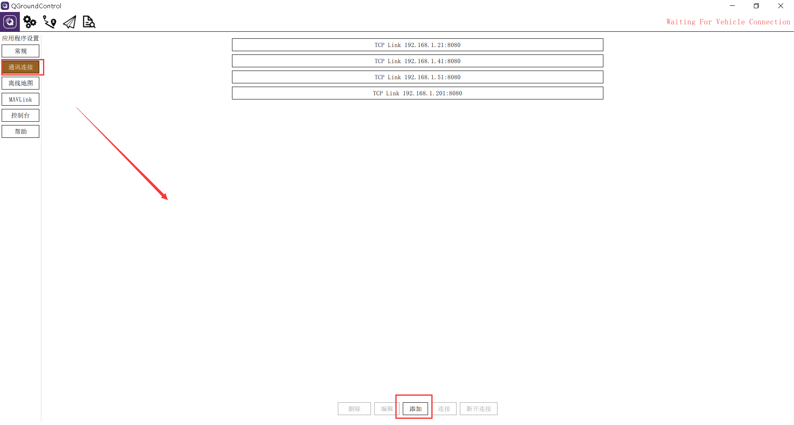
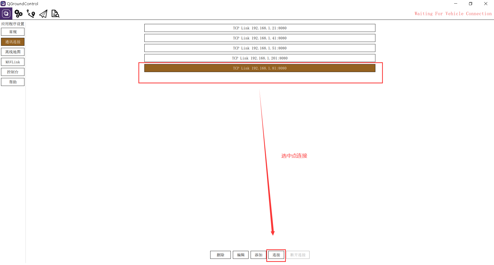

.. 图数传移动端连接飞控

=====================================
第八章   图数传移动端连接飞控
=====================================

8.1  连接飞控
=================

.. tip::

    此步骤需要笔记本连接地面端图数传的网口后才可进行，而且你已经在笔记本上ping通了飞机端图数传，并且飞控连上了飞机端数传的串口。

这里我的飞控连接的是飞机端图数传的串口1：

.. image:: ../images/QGC_Conf2.JPG

查看飞机端的串口1的IP及端口，我这里为TCP类型 ip为：192.168.1.81 端口为8080：

.. image:: ../images/Wifi_Air.png

打开QGC，选择通信连接->添加： 

所以QGC添加通信这里就选择TCP类型，名称任意，主机地址就为192.168.1.81，端口8080，然后确定即可。

.. image:: ../images/QGC_Conf3.png

点击你的配置名称，然后点击连接，即可连接飞控了。

 

8.2  整体效果
=================

1.飞控连接成功后，可按前面章节介绍，添加网络摄像头，整体接线如下。
     .. image:: ../images/fk06.png

2.打开QGC地面站，按照前面章节的介绍添加网络摄像头RTSP的URL连接，显示效果如下。
     .. image:: ../images/fk07.png

3.配合前面章节的介绍，可以在PC端打开NoMachine远程访问移动端(板载计算机或TX2等)，同时打开地面站查看飞控数据和网络摄像头图像，效果如下。
     .. image:: ../images/fk08.png
     .. image:: ../images/fk09.png