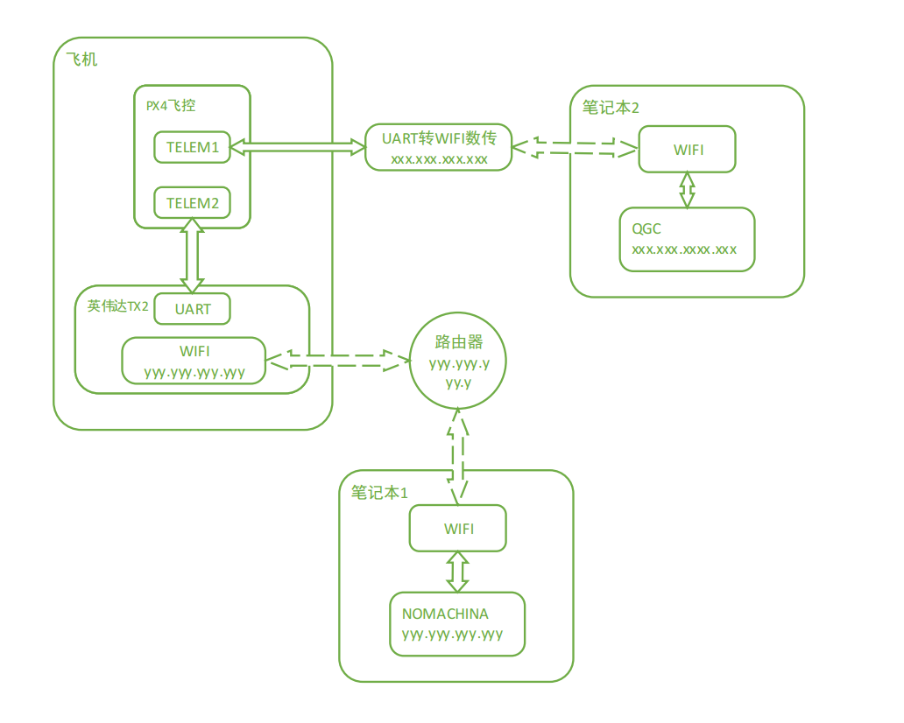
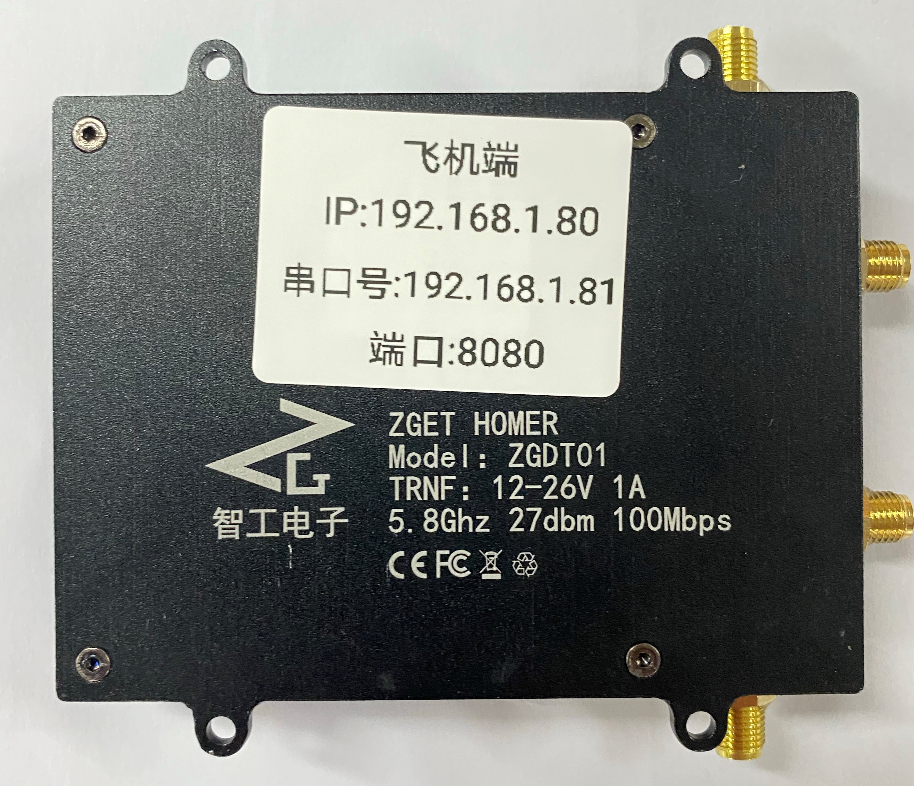

.. 自主飞行之入门:

==========================
自主飞行之入门
==========================

1.ROS
========

ROS官网: `维基 <http://wiki.ros.org/>`__ 

ROS是用于开发复杂的分布式机器人系统的广泛使用的框架.

a. 安装
^^^^^^^^^^

主要参考: `官网安装说明 <http://wiki.ros.org/kinetic/Installation/Ubuntu>`__

在飞机上的机载计算机TX2上已经安装好了ROS.

如果要在PC上面使用ROS,我们建议使用Ubuntu Linux系统.Windows系统下面可以使用VMware虚拟机,Mac系统可以使用 **VirtualBox** 或者是 **Parallels Desktop Lite**

.. tip::

    我们建议使用Ubuntu18.04与之相对应的ROS版本Melodic.

b.基本概念
^^^^^^^^^^^^^^^

**节点(nodes):**

主要参考来源: `ROS节点 <http://wiki.ros.org/Nodes>`__

ROS节点是一个特殊的程序,通常使用Python或者C++编写,可以通过ROS主题和ROS服务与其他节点进行通信.将复杂的机器人系统划分为孤立的节点具有某些优点:减少代码的耦合性,提高可重用性和可靠性

许多机器人库和驱动程序都是以ROS节点的形式执行.

为了将普通程序变成ROS节点,请包含rospy或roscpp库,并插入初始化代码.

2.MAVROS
==========

3.px4_command介绍
====================

px4_command功能包是一个基于PX4开源固件及Mavros功能包的开源项目，旨在为PX4开发者提供更加简洁快速的开发体验。
目前已集成无人机外环控制器修改、目标追踪、激光SLAM定位、双目V-SLAM定位、激光避障等上层开发代码、后续将陆续推
出涵盖任务决策、路径规划、滤波导航、单/多机控制等无人机/无人车/无人船科研及开发领域的功能。
配合板载计算机(树莓派、TX2、Nano)等运算能力比较强的处理器，来实现复杂算法的运行，运行得到的控制指令通过串口或者网口通信发送给底层控制板。

-   **state_from_mavros.h**:订阅飞控状态,包括无人机当前的状态(/mavros/state),当前位置(/mavros/local_position/pose),当前速度(/mavros/local_position/velocity_local),和当前角度,角速度(/mavros/imu/data)
-   **command_to_mavros.h**:发布px4_command功能包生成的控制量至mavros功能包,可发送期望位置,速度(本地系与机体系),角度,角速度,底层控制(遥控器输入)
-   **px4_pos_estimator.cpp**:订阅激光雷达或者mocap发布的位置信息,并进行坐标转换,在state_from_mavros.h中已订阅飞控发布的位置,速度,欧拉角信息,此处直接使用,根据订阅的数据,发布相应的位置,偏航角给飞控
-   **px4_pos_controller.cpp**:订阅由位置估计发布的DroneState,初始化当前飞机状态的时间.订阅ControlCommand(不知从何发布的数据).发布topic_for_log主题.在选择控制率,检查参数正确后,初始化完成.对move节点中,takeoff,Move_ENU,Move_Body,Hold,Land,Disarm,PPN_land和Trajectory_Tracking等进行逻辑处理.
-   **ground_station.cpp**:订阅自定义日志主题(/px4_command/topic_for_log),订阅视觉系统位置估计PoseStamped主题(/vrpn_client_node/UAV/pose,非mavlink消息,数据包括point位置(x,y,z),四元数方向(w,x,y,z)),订阅飞控姿态四元数AttitudeTarget主题(/mavros/setpoint_raw/target_attitude,#82号mavlink消息).不断的更新视觉传感器状态,并打印当前飞机的状态.
-   **px4_sender.cpp**:订阅自定义消息控制指令主题(/px4_command/control_command),机体系到惯性系坐标转换,move中控制命令的具体实现(0表示位置控制,3表示速度控制)
-   **autonomous_landing.cpp**:降落识别使用xyz均为速度控制.订阅数据包括降落板与无人机的相对位置,降落板与无人机的相对偏航角,视觉flag 来自视觉节点.最后发布位置控制指令
-   **collisiom_avoidance_streo.cpp**:订阅/streo_distance该数据作为计算飞机四个方向的距离判断.
-   **formation_control_sitl.cpp**:多机仿真SITL,只适用于Move_ENU坐标系下,若使用Move_Body,需自行添加修改.
-   **payload_drop.cpp**:订阅/mavros/local_position/pose本地位置.发布遥控器通道值.
-   **square.cpp**:发布/px4_command/control_command命令.子模式xyz均为位置控制.
-   **target_tracking.cpp**:
-   **move.cpp**:发布/px4_command/control_command,并设置子模式xy速度控制(0b10),位置控制.z速度控制(0b01),位置控制
-   **set_mode.cpp**:模拟遥控器,根据mavros服务,进行在SITL下解锁,切换offboard,控制飞行器.
-   **TFmini.cpp**:激光定高雷达的处理,如果需要添加超声波传感器,可参考此代码.

4.飞行前准备
===============

图数传地面端和飞机端
^^^^^^^^^^^^^^^^^^^^^^^
图数传模块：
"""""""""""""""""""""""
.. image:: ../images/WIFI_IMAGE_model.png

.. tip::

    图数传的配置工具请在百度网盘自主下载
    `网盘链接 <https://pan.baidu.com/s/1jmf89LwA5vBB8o1Pp69DnQ>`__
    提取码: **1evo**

根据配置模式有两种连接方式：一种是无线AP模式,另外一种无线STA模式.

地面端图数传配置成无线AP模式
"""""""""""""""""""""""""""""""

我们发货前默认会将地面端配置为AP模式，其中地面端图数传会创建一个wifi热点，
通常我们配置的默认wifi名称为：amov-01,密码为：123456789 （此热点电脑搜索不到，仅图数传可搜索）

飞机端图数传配置成无线STA模式
""""""""""""""""""""""""""""""""

飞机端图数传在我们发货前也会默认进行配置为无线STA模式，并连接上地面端的wifi，并经过测试，
通常您拿到手的图数传已经是配置好了。

图数传远程连接QGroundControl
^^^^^^^^^^^^^^^^^^^^^^^^^^^^^^^^^^^^^

在图数传连接QGroundControl的过程中,本小节文档中会分为两种情况来说明正常连接的过程以及非正常连接的过程.

正常连接
""""""""""""""""""""

.. tip::

    飞机说明:本教程飞机配置为TX2+pixhawk4+吊舱

飞机整机图:

飞机端图数传上面贴有标签,我这里串口1的ip为192.168.1.81 端口为8080，记录下此ip和端口供后面连接使用

首先拿到飞机之后,上电,同时将地面端图数传上电，使用网口转GH1.25 4P连接地面端与笔记本：

.. warning::

    请勿将电源线接入网口或串口，否者可能造成您的设备损坏。

.. image:: ../images/Wifi_Connect.png

然后打开一个终端,ping一下地面端图数传的IP:192.168.1.100(ping通说明笔记本与地面端连接成功)

.. image:: ../images/Wifi_Des_conn.png

接着ping飞机端的串口1（通常飞控连接的是飞机端图数传的串口1）：

.. image:: ../images/Ping_Air.png

发现已经ping成功了,说明我们可以连接到QGroundControl地面站上面了.

接着,打开QGC,第一步是打开 应用程序设置 菜单栏;第二步是选择 通讯连接 侧边栏;下面会出现五个可修改功能按钮,分别为删除,编辑,添加,连接,断开连接.第三步是点击 添加 按钮.(此处图片为qgc的连接1~3)

接着添加飞机端图数传的串口1（飞控连接的接口），类型为TCP，然后点击确认即可

选中刚才添加的通讯连接,第九步点击下面的连接按钮,进行连接到QGC.

.. image:: ../images/QGC_Set3.png

可以看到WIFI数传连接成功,地面站上显示飞控的各个信息.

.. image:: ../images/QGC_Set4.png

非正常连接
""""""""""""""""""""""

.. tip::

    如果您的图数传不能正常连接，请按照以下教程进行重置图数传飞机端与地面端

**地面端图数传设置**

- 硬件连接

使用网口转GH1.25 4P连接地面端LAN口与电脑网口

.. image:: ../images/LAN_To_4Pin.JPG

.. image:: ../images/WIfi_Lan.png

使用XT30转GH1.25 4P连接地面端与4s电池进行供电

.. image:: ../images/XT30To4P.JPG

.. image:: ../images/Wifi_Power.png

整体接线如下：

.. image:: ../images/Wifi_Connect.png

.. warning::

    请勿将电源线接入网口或串口，否者可能造成您的设备损坏。

-软件配置

通电前将地面端图数传串口3上面的开关拨到左侧（AP）请勿随意拨动开关，可能造成配置混乱。

1. 配置电脑静态IP

按照接线将地面端上电并连入电脑网口，关闭电脑WIFI，打开网络链接，双击以太网：

.. image:: ../images/WIfi_NetWork1.png

在属性->找到IPV4选项并双击：

.. image:: ../images/Wifi_NetWork2.png

配置静态IP为192.168.1.x,子网掩码为255.255.255.0,网关为192.168.1.1：

.. image:: ../images/Wifi_NetWork3.png

设置完成后依次点击每个窗口的确定按钮进行关闭。

2. 配置图数传串口

图数传模块有三个串口，如果要使用这些串口，就需要在配置软件中进行配置

打开网盘中提供的配置软件（ZLVirCom5.42.exe）
点击设备管理：

配置每个串口的IP以及波特率等信息： 

.. image:: ../images/Wifi_Vir2.png

这里我配置串口1为如下：

.. image:: ../images/Wifi_Urt_Conf1.png

串口2：

.. image:: ../images/Wifi_Urt_Conf2.png

串口3：

.. image:: ../images/Wifi_Urt_Conf3.png

配置之后点击修改设置即可，配置之后显示如下：

.. image:: ../images/Wifi_Urt_Conf4.png

3. 配置图数传WIFI

根据图数传底下提供的IP,在浏览器地址栏输入该IP(一般地面端AP模式的IP均为192.168.1.100):

.. image:: ../images/Wifi_Conf1.JPG

进入配置网页进行登陆，用户名密码均为admin：

.. image:: ../images/Wifi_Conf2.JPG

登陆后可以看到当前模式为STA模式，点击Wireless:

.. image:: ../images/Wifi_Conf3.JPG

设置WIFI以及密码：

.. image:: ../images/Wifi_Conf4.JPG

之后点击Save保存

**飞机端图数传设置**

- 硬件连接

同地面端

- 软件配置

通电前将飞机端图数传串口3上面的开关拨到左侧（STA）。

.. image:: ../images/Wifi_Sta.JPG

1. 配置电脑静态IP

同地面端

2. 配置图数传串口

图数传模块有三个串口，如果要使用这些串口，就需要在配置软件中进行配置

打开网盘中提供的配置软件（ZLVirCom5.42.exe）
点击设备管理：

配置每个串口的IP以及波特率等信息： 

.. image:: ../images/Wifi_Vir2.png

这里我配置串口1为如下：

.. image:: ../images/Wifi_Urt_Conf5.png

串口2：

.. image:: ../images/Wifi_Urt_Conf6.png

串口3：

配置之后点击修改设置即可，配置之后显示如下：

.. image:: ../images/Wifi_Urt_Conf8.png

3. 配置图数传WIFI

根据图数传底下提供的IP,在浏览器地址栏输入该IP:

进入配置网页进行登陆，用户名密码均为admin：

.. image:: ../images/Wifi_Sta_Conf1.png

登陆后可以看到当前模式为AP模式，点击Wireless:

.. image:: ../images/Wifi_Sta_Conf2.png

选择Scan扫描Wifi：

将地面端上电，并选中地面端WIFI填入密码，点击Connect:

接下来测试是否配置成功：重启图数传地面端和飞机端，假设你配置成功，
那么飞机端图数传会自动连接地面端图数传。那么我们将笔记本连接上地面端网口，
打开终端(cmd)，分别ping 192.168.1.80,192.168.1.81,192.168.1.82，192.168.1.83
尝试ping一下我们的飞机端图数传的几个串，都ping通了，那么恭喜你搞定了，
ping不通那么你需要打开需要检查上面的配置是否有错误。 

.. image:: ../images/Ping_Sucess.png

- 地面站连接:

.. tip::

    此步骤需要笔记本连接地面端图数传的网口后才可进行，而且你已经在笔记本上ping通了飞机端图数传，并且飞控连上了飞机端数传的串口。

打开QGC，选择通信连接->添加： 

.. image:: ../images/QGC_Conf1.png

这里我的飞控连接的是飞机端图数传的串口1：

.. image:: ../images/QGC_Conf2.JPG

刚才我们配置飞机端图数传的串口1的为TCP类型 ip为：192.168.1.81 端口为8080

.. image:: ../images/Wifi_Urt_Conf5.png

所以QGC添加通信这里就选择TCP类型，名称任意，主机地址就为192.168.1.81，端口8080，然后确定即可。

点击你的配置名称，然后点击连接，即可连接飞控了。

.. image:: ../images/QGC_Connect.png

远程连接TX2
^^^^^^^^^^^^^^^^^^

需要的硬件:

-   1. 有HDMI接口的显示器一台(用于显示TX2，TX2连接你准备好的路由器的WiFi)
-   2. 带宽比较好的路由器一台
-   3. 安装有QGC地面站与NoMachine电脑一台或两台

**NoMachine配置**:此步骤需要英伟达TX2中的Ubuntu系统使用网口转GH1.25 4P连接图数传飞机端，并在终端上输入ifconfig命令找到TX2的IP（我的TX2 IP为192.168.1.84）。
我们通常在发货前会将TX2的ip设置为静态的，比如您的飞机端图数传ip为192.168.1.80，则TX2的IP就设置为192.168.1.84
TX2连接飞机端图数传：

打开NOMACHINA软件，点击 New新建

.. image:: ../images/WIFI_nomachine_create_new.png

Protrocol选择NX模式，然后输入TX2的IP地址192.168.1.84，Port默认4000

.. image:: ../images/NoMachine1.png

下一步，鉴定方式选择Password，下一步选择Do not use proxy，最后Done

如下选择刚才配置的参数，点击连接

.. image:: ../images/NoMachine2.png

成功后点击YES

输入TX2的用户名以及密码(默认amov) 然后一路OK即可进行访问。

.. image:: ../images//NoMachine3.png

.. image:: ../images/NoMachine4.png

