自主飞行之进阶
===================

1. 吊舱视觉跟踪
===================

a. 吊舱连接
--------------------------------
进行吊舱视觉跟踪测试前需要先确认吊舱是否连接

1. 给飞机上电，启动飞机后，听到吊舱发出两段提示音则表示吊舱启动正常。

2. 输入lsusb查看是否有image technology corp，有则继续，无则重新插拔USB或重启吊舱。

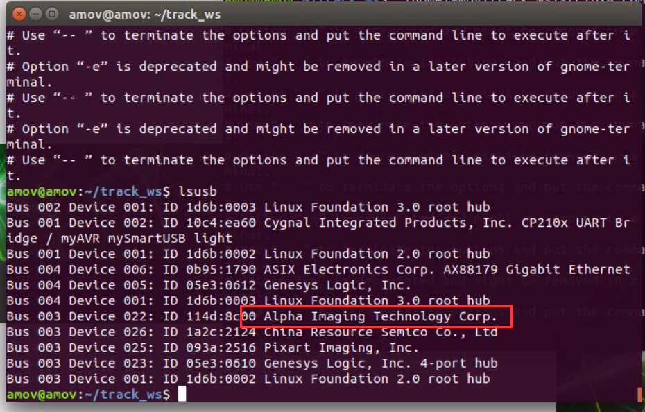

3.	输入ls /dev | grep video，是否出现video0，有则继续，无则重新插拔。

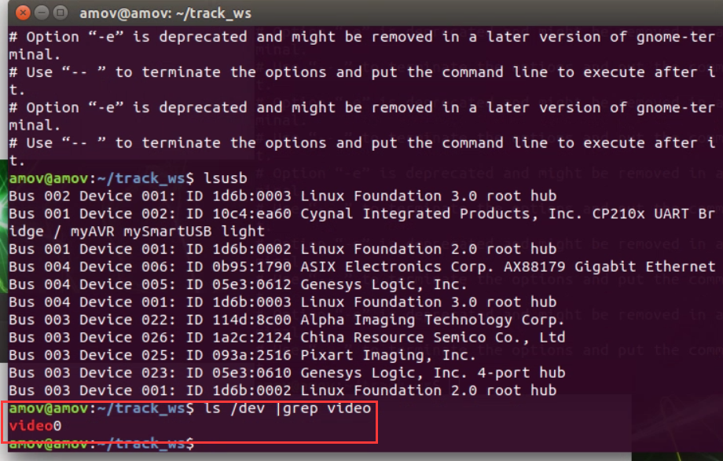

4.打开Ubuntu自带软件Cheese,查看是否有图像：

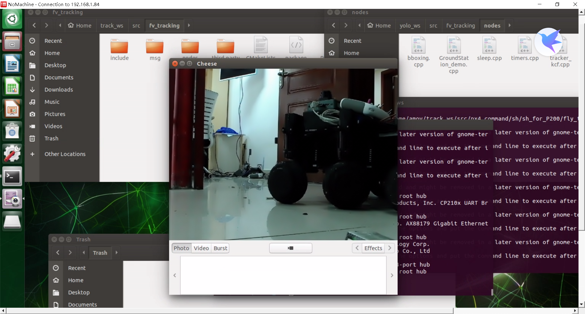

b. 室内测试
--------------------------------

1. 在出去外场测试之前要先在室内测试吊舱各项功能是否正常，首先使用Nomachine连接TX2的远程桌面。

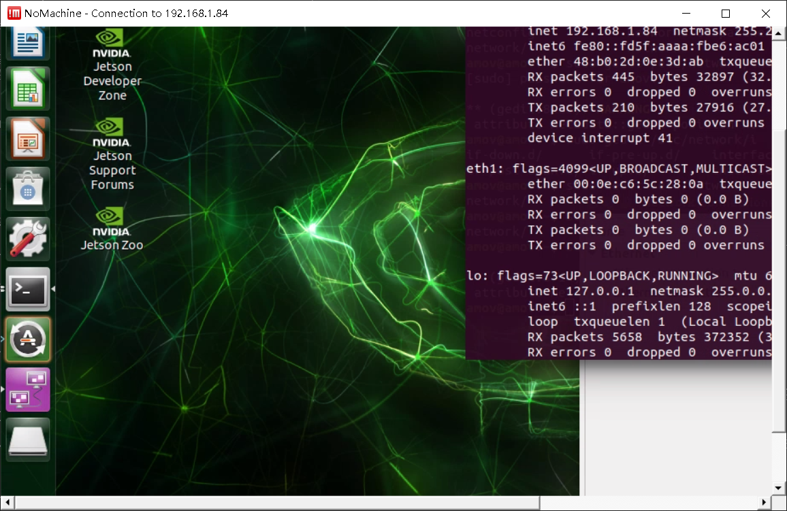

2. 接着运行如下目录的脚本文件：
/home/amov/track_ws/src/px4_command/sh/sh_for_P200/fly_tracking_test.sh

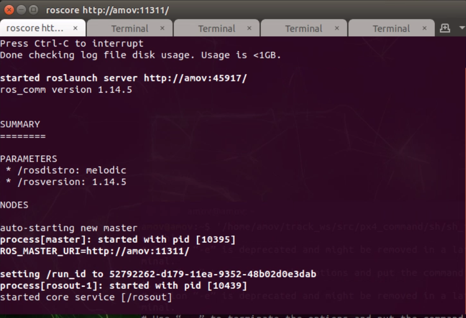

3. 会运行五个终端，依次检查每个终端是否有报错，这里第二个终端报错（打不开视频）：

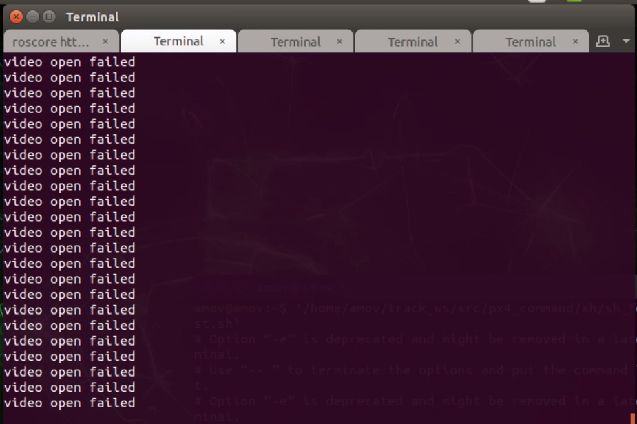

4. 请确保吊舱电源是否开启，并且吊舱的USB线插入TX2,通常在TX2上电后需要重启下吊舱，否者可能造成TX2连接不上吊舱，
按压吊舱电源键重启吊舱：

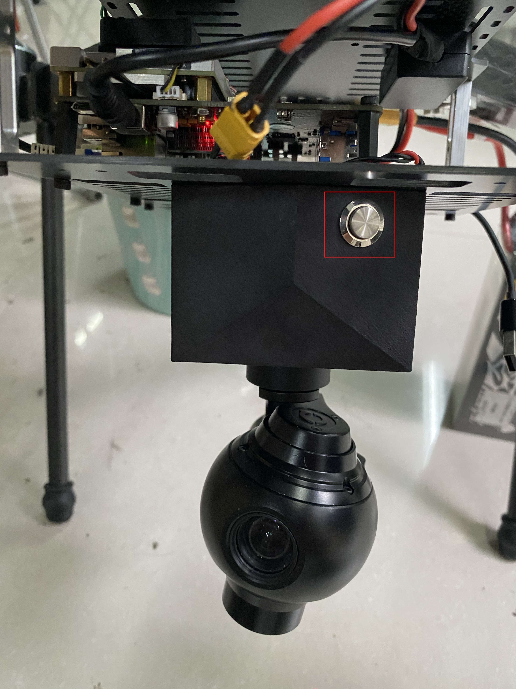

5. 再次运行脚本,运行成功:

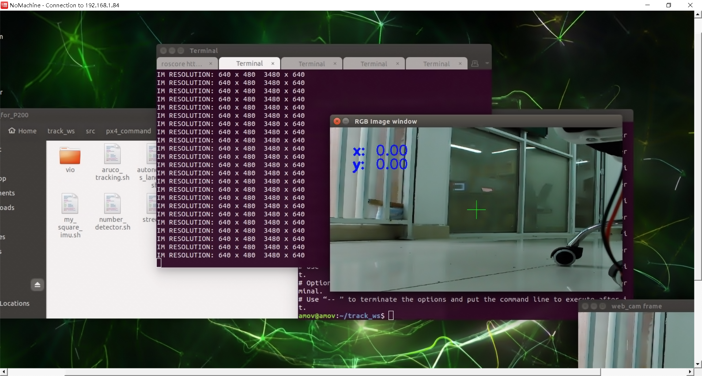

6. 框选一个物体，测试吊舱是否能够跟踪：

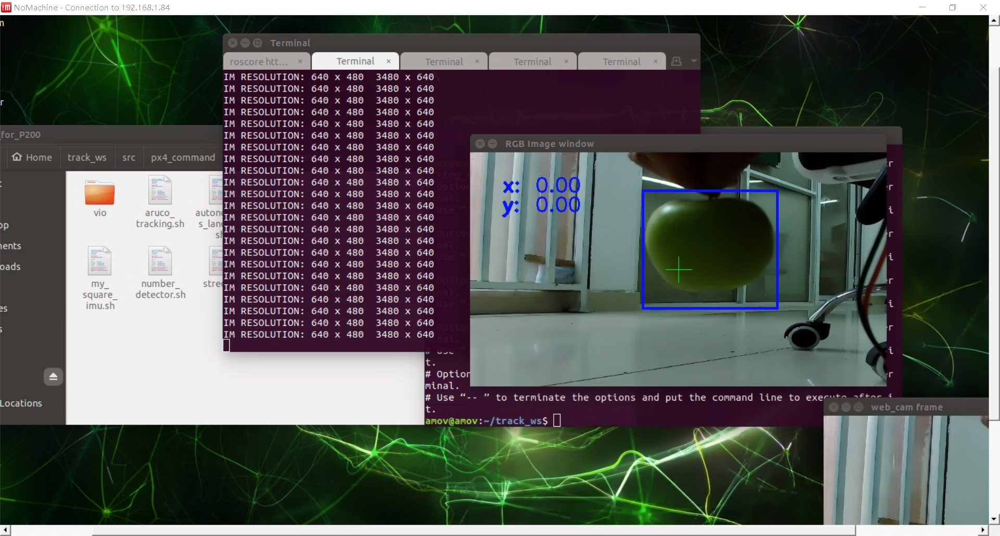

c. 室外测试
----------------------------

室外测试需要使用NoMachine连接TX2的远程桌面，同时在TX2上框选要跟踪的目标

1.	在完成初步测试之后，让飞手在自稳模式或定点模式下试飞飞机，飞机正常则返回地面继续下面步骤
2.	启动fly_track_outdoor.sh文件

/home/amov/track_ws/src/px4_command/sh/sh_for_P200/fly_tracking_outdoor.sh

3. 观察各个终端，确保都没有错误
4. 在倒数第三个终端窗口输入0选择PID，输入1选择GO ON

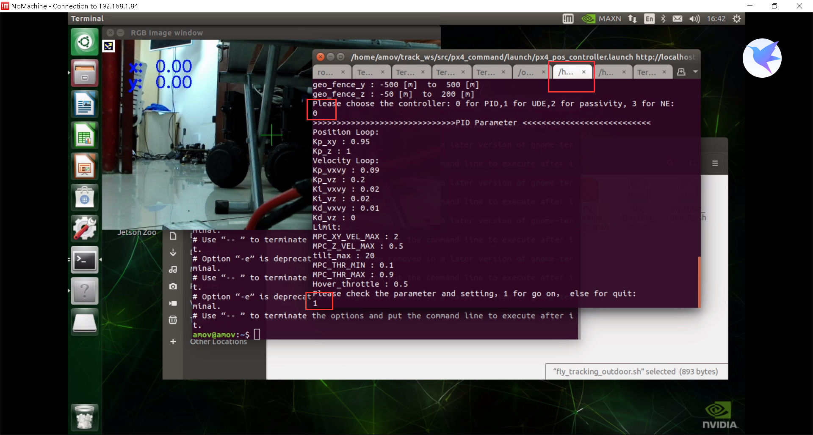

5. 在倒数第二个终端窗口输入1选择go on，输入777选择track

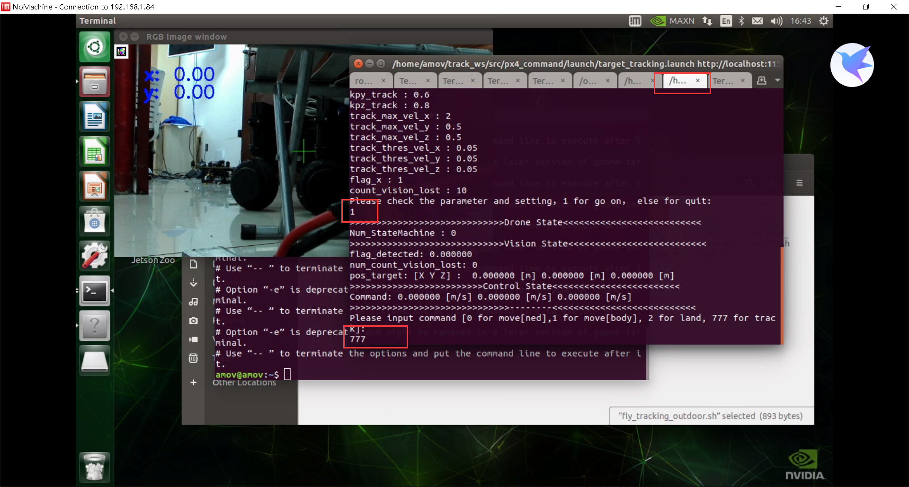

3.	飞手尝试切换offboard模式，能切换成功则在position模式下飞到一定高度。

.. tip::

    飞机在offboard模式进行视觉跟踪，在起飞前一定要确保能切换到offboard模式

4.	框选目标观测速度数据是否正常，正常则继续

框选目标：
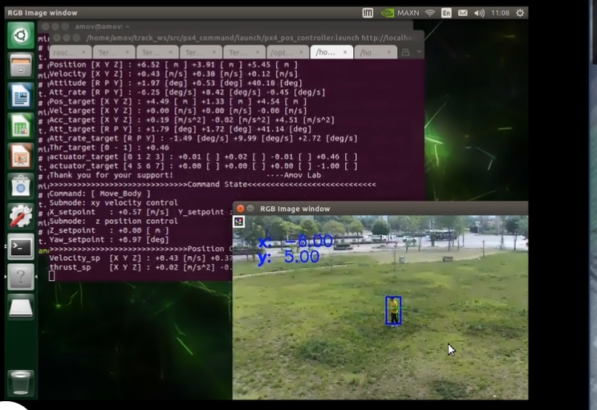
观察数据是否正常：
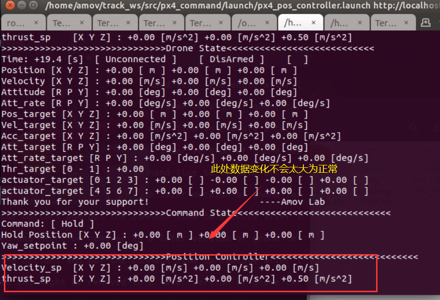

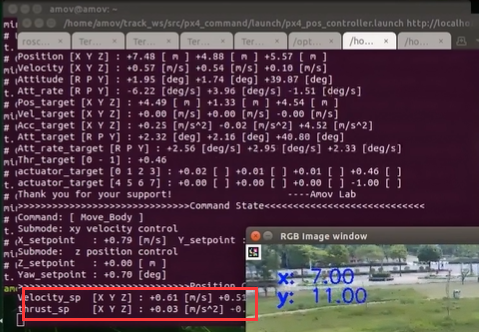

5.	飞手切offboard模式飞机开始跟踪，并注意在意外情况下控制飞机切到自稳或者定点模式。

.. tip::

    演示及教学视频
    `铂贝学院 <https://bbs.amovlab.com/plugin.php?id=zhanmishu_video:video&mod=video&cid=31&vid=894>`__

